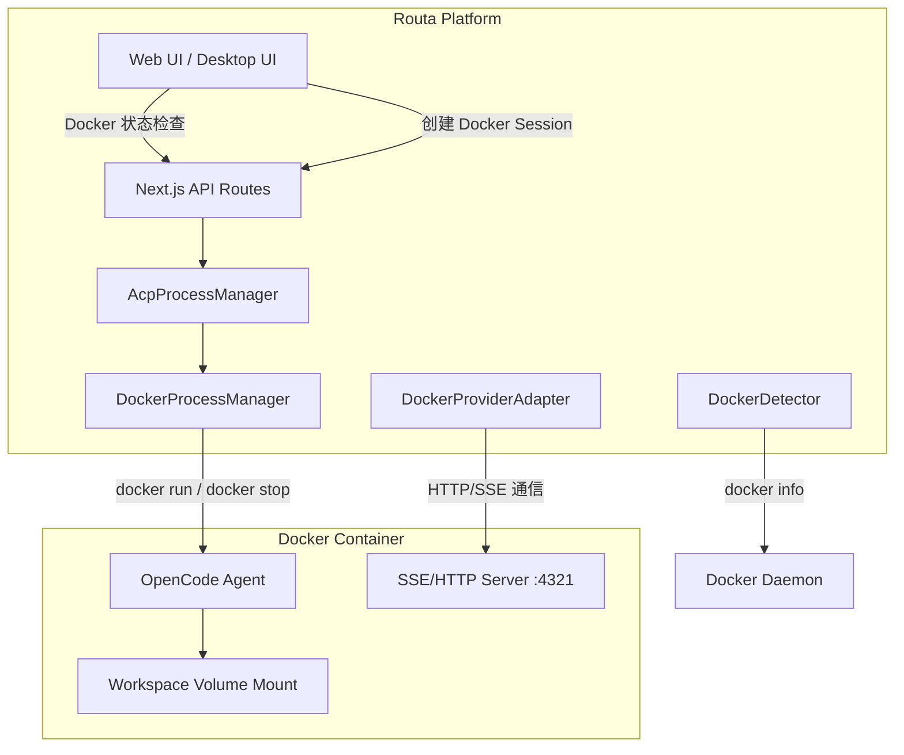
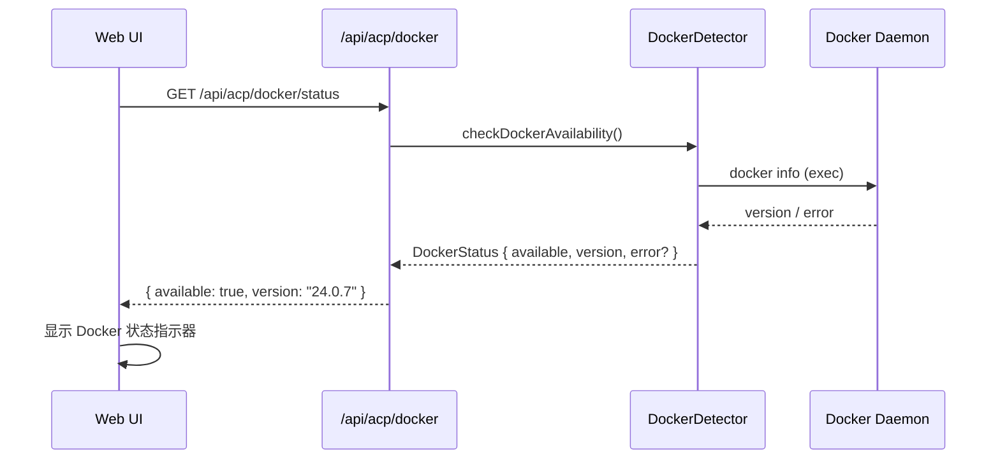
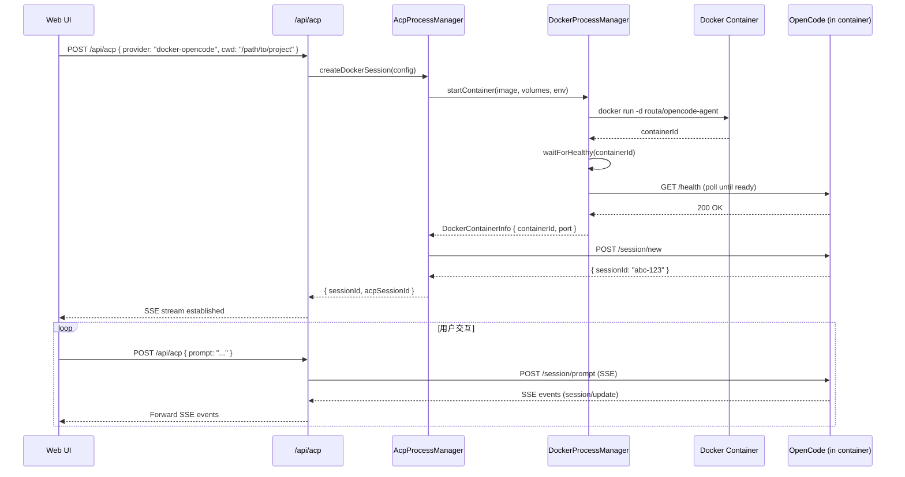
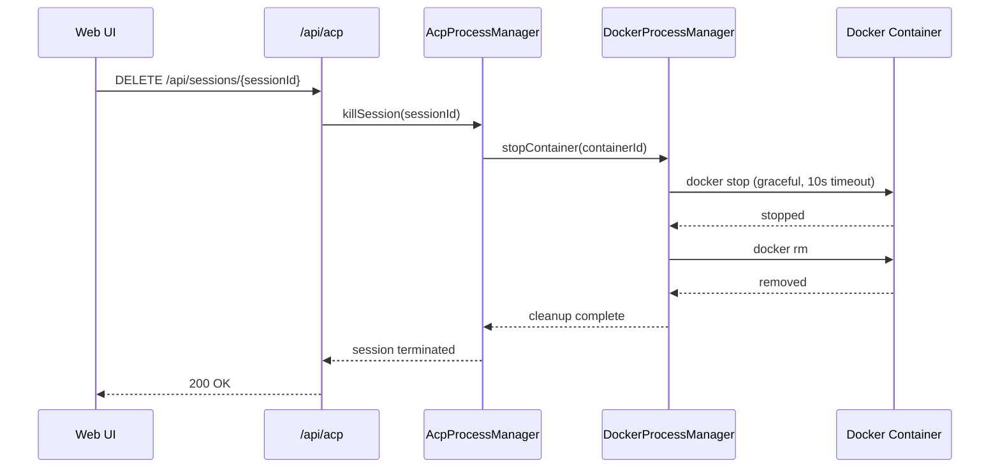

# 设计文档: Docker-based Agent Execution (OpenCode)

## 概述

本功能为 Routa.js 平台新增基于 Docker 容器的 Agent 执行模式。用户可以在 Docker 容器中运行 OpenCode agent，通过 ACP (Agent Communication Protocol) 与之交互。这种模式解决了本地环境依赖问题，提供了隔离、可复现的 agent 执行环境。

核心思路：Routa 启动一个 Docker 容器，容器内运行 OpenCode（以 HTTP/SSE 模式），Routa 通过 HTTP 与容器内的 OpenCode 通信。原有的 gRPC 交互方式需要封装为 SSE，以便与现有的 ACP provider adapter 架构兼容。

系统需要在启动时检测 Docker 可用性，在 UI 上展示 Docker 状态，并提供完整的容器生命周期管理（创建、启动、停止、销毁）。

## 架构



## 主要工作流 Sequence Diagram

### 1. Docker 可用性检测



### 2. Docker Session 创建与交互



### 3. 容器停止与清理



## 组件与接口

### Component 1: DockerDetector — Docker 可用性检测

**职责**: 检测宿主机 Docker 环境是否可用，获取版本信息，缓存检测结果。

```typescript
interface DockerStatus {
  available: boolean;
  version?: string;
  apiVersion?: string;
  error?: string;
  checkedAt: Date;
}

interface IDockerDetector {
  /** 检测 Docker 是否可用（带缓存，默认 30s） */
  checkAvailability(forceRefresh?: boolean): Promise<DockerStatus>;
  /** 检查指定镜像是否已拉取 */
  isImageAvailable(image: string): Promise<boolean>;
  /** 拉取镜像 */
  pullImage(image: string): Promise<void>;
}
```

**实现要点**:
- 通过 `docker info` 命令检测 Docker daemon
- 结果缓存 30 秒，避免频繁 exec
- Desktop (Tauri) 模式下通过 Tauri bridge 调用

### Component 2: DockerProcessManager — 容器生命周期管理

**职责**: 管理 Docker 容器的创建、启动、健康检查、停止和清理。

```typescript
interface DockerContainerConfig {
  /** Docker 镜像名 */
  image: string;
  /** 宿主机工作目录（挂载到容器内） */
  hostCwd: string;
  /** 容器内工作目录 */
  containerCwd: string;
  /** 环境变量（API keys 等） */
  env?: Record<string, string>;
  /** 额外的 volume 挂载 */
  extraVolumes?: string[];
  /** 容器内 OpenCode 监听端口 */
  containerPort: number;
  /** 宿主机映射端口（0 = 自动分配） */
  hostPort?: number;
}

interface DockerContainerInfo {
  containerId: string;
  containerName: string;
  hostPort: number;
  status: "creating" | "starting" | "healthy" | "unhealthy" | "stopped" | "error";
  createdAt: Date;
  baseUrl: string; // e.g. "http://localhost:54321"
}

interface IDockerProcessManager {
  /** 启动一个新的 OpenCode 容器 */
  startContainer(config: DockerContainerConfig): Promise<DockerContainerInfo>;
  /** 停止并移除容器 */
  stopContainer(containerId: string): Promise<void>;
  /** 获取容器状态 */
  getContainerStatus(containerId: string): Promise<DockerContainerInfo | null>;
  /** 列出所有 Routa 管理的容器 */
  listContainers(): DockerContainerInfo[];
  /** 停止所有容器（应用退出时调用） */
  stopAll(): Promise<void>;
  /** 健康检查 */
  waitForHealthy(containerId: string, timeoutMs?: number): Promise<boolean>;
}
```

### Component 3: DockerOpenCodeAdapter — Docker 容器内 OpenCode 的 ACP 适配器

**职责**: 通过 HTTP/SSE 与 Docker 容器内的 OpenCode 通信，将其消息格式转换为 Routa 统一的 NormalizedSessionUpdate。

```typescript
interface IDockerOpenCodeAdapter {
  /** 连接到容器内的 OpenCode */
  connect(baseUrl: string): Promise<void>;
  /** 创建新会话 */
  createSession(title?: string): Promise<string>;
  /** 发送 prompt 并返回 SSE 流 */
  promptStream(sessionId: string, prompt: string): AsyncGenerator<NormalizedSessionUpdate>;
  /** 取消当前请求 */
  cancel(): void;
  /** 关闭连接 */
  close(): Promise<void>;
  /** 适配器是否存活 */
  readonly alive: boolean;
  /** 当前 ACP session ID */
  readonly acpSessionId: string | null;
}
```

**实现要点**:
- 复用 `OpencodeSdkAdapter` 的核心逻辑，但连接目标改为 Docker 容器的 HTTP 端口
- 消息格式与标准 OpenCode SSE 一致，无需额外转换
- 需要处理容器网络延迟和连接中断

### Component 4: DockerProviderAdapter — Provider Adapter 层

**职责**: 作为 provider-adapter 架构中的 Docker 适配器，处理消息规范化。

```typescript
// 新增 ProviderType
type ProviderType = 
  | "claude" | "opencode" | "kimi" | "gemini" 
  | "copilot" | "codex" | "auggie" | "kiro" 
  | "workspace" | "standard"
  | "docker-opencode";  // 新增

class DockerOpenCodeProviderAdapter extends BaseProviderAdapter {
  constructor() {
    super("docker-opencode");
  }

  getBehavior(): ProviderBehavior {
    return {
      type: "docker-opencode",
      immediateToolInput: false, // 与 OpenCode 一致
      streaming: true,
    };
  }

  normalize(
    sessionId: string,
    rawNotification: unknown
  ): NormalizedSessionUpdate | NormalizedSessionUpdate[] | null {
    // 复用 OpenCodeAdapter 的 normalize 逻辑
    // Docker 内的 OpenCode 消息格式与本地 OpenCode 一致
  }
}
```

### Component 5: UI 组件 — Docker 状态与控制

**职责**: 在 UI 上展示 Docker 可用性状态，提供 Docker 模式的 agent 选择。

```typescript
interface DockerStatusIndicatorProps {
  /** Docker 检测状态 */
  status: DockerStatus;
  /** 点击重新检测 */
  onRefresh: () => void;
}

interface DockerAgentSelectorProps {
  /** Docker 是否可用 */
  dockerAvailable: boolean;
  /** 选择 Docker agent 时的回调 */
  onSelect: (config: DockerContainerConfig) => void;
}
```

## 数据模型

### DockerContainerRecord — 容器持久化记录

```typescript
interface DockerContainerRecord {
  /** 容器 ID (Docker short ID) */
  containerId: string;
  /** 容器名称 (routa-agent-{sessionId}) */
  containerName: string;
  /** 关联的 Routa session ID */
  sessionId: string;
  /** 关联的 workspace ID */
  workspaceId?: string;
  /** 使用的 Docker 镜像 */
  image: string;
  /** 宿主机映射端口 */
  hostPort: number;
  /** 容器状态 */
  status: "running" | "stopped" | "error" | "removed";
  /** 创建时间 */
  createdAt: Date;
  /** 停止时间 */
  stoppedAt?: Date;
}
```

**验证规则**:
- `containerId` 必须是有效的 Docker container ID（12+ 位 hex）
- `hostPort` 必须在 1024-65535 范围内
- `image` 必须是有效的 Docker 镜像引用
- `sessionId` 必须关联到已存在的 ACP session

### AcpAgentPreset 扩展 — Docker Provider 预设

```typescript
// 新增 Docker OpenCode preset
const dockerOpenCodePreset: AcpAgentPreset = {
  id: "docker-opencode",
  name: "OpenCode (Docker)",
  command: "docker",  // 实际不通过 CLI 启动，而是通过 DockerProcessManager
  args: [],
  description: "Run OpenCode agent in a Docker container for isolated execution",
  nonStandardApi: true,  // 使用自定义的 Docker 适配器
  source: "static",
  capabilities: ["mcp_tool", "code_generation", "file_operations"],
  supportedRoles: ["CRAFTER", "DEVELOPER"],
  env: {},
};
```

## Algorithmic Pseudocode

### 算法 1: Docker 可用性检测

```typescript
async function checkDockerAvailability(forceRefresh = false): Promise<DockerStatus> {
  // 前置条件: 无
  // 后置条件: 返回 DockerStatus，available 字段准确反映 Docker daemon 状态

  if (!forceRefresh && cache.isValid()) {
    return cache.get();
  }

  try {
    const { stdout } = await execAsync("docker info --format '{{json .}}'", {
      timeout: 5000,
    });
    const info = JSON.parse(stdout);

    const status: DockerStatus = {
      available: true,
      version: info.ServerVersion,
      apiVersion: info.ApiVersion,
      checkedAt: new Date(),
    };

    cache.set(status, TTL_30S);
    return status;
  } catch (error) {
    const status: DockerStatus = {
      available: false,
      error: error instanceof Error ? error.message : "Docker not available",
      checkedAt: new Date(),
    };

    cache.set(status, TTL_30S);
    return status;
  }
}
```

**前置条件**: 无特殊要求
**后置条件**: 返回的 `DockerStatus.available` 准确反映 Docker daemon 是否可达
**循环不变量**: N/A

### 算法 2: 容器启动与健康检查

```typescript
async function startContainer(config: DockerContainerConfig): Promise<DockerContainerInfo> {
  // 前置条件: Docker daemon 可用, config.image 已拉取或可拉取
  // 后置条件: 返回的 DockerContainerInfo.status === "healthy"

  // Step 1: 确保镜像存在
  if (!await isImageAvailable(config.image)) {
    await pullImage(config.image);
  }

  // Step 2: 分配端口
  const hostPort = config.hostPort || await findAvailablePort(49152, 65535);

  // Step 3: 构建 docker run 命令
  const containerName = `routa-agent-${generateShortId()}`;
  const args = [
    "run", "-d",
    "--name", containerName,
    "-p", `${hostPort}:${config.containerPort}`,
    "-v", `${config.hostCwd}:${config.containerCwd}`,
    "--label", "routa.managed=true",
  ];

  // 注入环境变量（API keys 等）
  if (config.env) {
    for (const [key, value] of Object.entries(config.env)) {
      args.push("-e", `${key}=${value}`);
    }
  }

  // 额外 volume 挂载
  if (config.extraVolumes) {
    for (const vol of config.extraVolumes) {
      args.push("-v", vol);
    }
  }

  args.push(config.image);

  // Step 4: 启动容器
  const { stdout } = await execAsync(`docker ${args.join(" ")}`);
  const containerId = stdout.trim().substring(0, 12);

  const info: DockerContainerInfo = {
    containerId,
    containerName,
    hostPort,
    status: "starting",
    createdAt: new Date(),
    baseUrl: `http://localhost:${hostPort}`,
  };

  // Step 5: 等待健康检查通过
  const healthy = await waitForHealthy(containerId, 30_000);
  if (!healthy) {
    await stopContainer(containerId);
    throw new Error(`Container ${containerId} failed health check within 30s`);
  }

  info.status = "healthy";
  containers.set(containerId, info);
  return info;
}
```

**前置条件**:
- Docker daemon 正在运行且可达
- `config.image` 是有效的 Docker 镜像引用
- `config.hostCwd` 是宿主机上存在的目录

**后置条件**:
- 返回的容器处于 "healthy" 状态
- 容器内 OpenCode HTTP 服务可达
- 容器已注册到内部管理列表

**循环不变量**: 健康检查轮询中，每次检查间隔 1 秒，总时间不超过 timeoutMs

### 算法 3: 容器停止与清理

```typescript
async function stopContainer(containerId: string): Promise<void> {
  // 前置条件: containerId 是有效的 Docker container ID
  // 后置条件: 容器已停止并移除，内部记录已清理

  const info = containers.get(containerId);

  try {
    // Step 1: 优雅停止（10 秒超时）
    await execAsync(`docker stop -t 10 ${containerId}`, { timeout: 15_000 });
  } catch {
    // 如果优雅停止失败，强制 kill
    await execAsync(`docker kill ${containerId}`).catch(() => {});
  }

  try {
    // Step 2: 移除容器
    await execAsync(`docker rm -f ${containerId}`);
  } catch {
    // 容器可能已被移除
  }

  // Step 3: 清理内部记录
  if (info) {
    info.status = "removed";
    info.stoppedAt = new Date();
  }
  containers.delete(containerId);
}
```

**前置条件**: `containerId` 对应一个由 Routa 管理的容器
**后置条件**: 容器已停止、移除，内部 Map 中已删除该记录
**循环不变量**: N/A

### 算法 4: Docker Session 创建（AcpProcessManager 集成）

```typescript
async function createDockerSession(
  workspaceCwd: string,
  presetId: string,  // "docker-opencode"
  env?: Record<string, string>,
  onNotification?: NotificationHandler
): Promise<{ sessionId: string; acpSessionId: string }> {
  // 前置条件: Docker 可用, presetId === "docker-opencode"
  // 后置条件: Docker 容器运行中, OpenCode session 已创建, SSE 通道就绪

  const sessionId = uuidv4();

  // Step 1: 启动 Docker 容器
  const containerInfo = await dockerProcessManager.startContainer({
    image: OPENCODE_DOCKER_IMAGE,
    hostCwd: workspaceCwd,
    containerCwd: "/workspace",
    containerPort: 4321,
    env: {
      ...env,
      OPENCODE_HOST: "0.0.0.0",
      OPENCODE_PORT: "4321",
    },
  });

  // Step 2: 创建 Docker OpenCode 适配器
  const adapter = new DockerOpenCodeAdapter(onNotification);
  await adapter.connect(containerInfo.baseUrl);

  // Step 3: 创建 OpenCode session
  const acpSessionId = await adapter.createSession();

  // Step 4: 注册到管理器
  dockerSessions.set(sessionId, {
    adapter,
    containerInfo,
    acpSessionId,
    presetId,
    createdAt: new Date(),
  });

  return { sessionId, acpSessionId };
}
```

**前置条件**:
- Docker daemon 可用
- `workspaceCwd` 是有效的本地目录路径
- 必要的环境变量（如 API keys）已提供

**后置条件**:
- Docker 容器正在运行且健康
- OpenCode HTTP 服务可达
- ACP session 已创建
- 适配器已注册，可接收 prompt

**循环不变量**: N/A

### 算法 5: 健康检查轮询

```typescript
async function waitForHealthy(
  containerId: string,
  timeoutMs: number = 30_000
): Promise<boolean> {
  // 前置条件: containerId 对应一个正在启动的容器
  // 后置条件: 返回 true 表示容器健康，false 表示超时

  const startTime = Date.now();
  const interval = 1_000; // 1 秒轮询间隔

  while (Date.now() - startTime < timeoutMs) {
    // 循环不变量: elapsed < timeoutMs
    try {
      const info = containers.get(containerId);
      if (!info) return false; // 容器已被移除

      const response = await fetch(`${info.baseUrl}/health`, {
        signal: AbortSignal.timeout(2_000),
      });

      if (response.ok) {
        return true;
      }
    } catch {
      // 容器尚未就绪，继续轮询
    }

    await sleep(interval);
  }

  return false;
}
```

**前置条件**: 容器已通过 `docker run` 启动
**后置条件**: 返回 boolean 表示容器是否在超时前变为健康状态
**循环不变量**: 每次循环开始时 `Date.now() - startTime < timeoutMs`

## Key Functions with Formal Specifications

### Function: DockerDetector.checkAvailability()

```typescript
async function checkAvailability(forceRefresh?: boolean): Promise<DockerStatus>
```

**前置条件**: 无
**后置条件**:
- 返回 `DockerStatus` 对象
- `available === true` 当且仅当 `docker info` 命令成功执行
- `version` 字段在 `available === true` 时非空
- `error` 字段在 `available === false` 时包含错误描述
- 结果被缓存 30 秒（除非 `forceRefresh === true`）

### Function: DockerProcessManager.startContainer()

```typescript
async function startContainer(config: DockerContainerConfig): Promise<DockerContainerInfo>
```

**前置条件**:
- `config.image` 是有效的 Docker 镜像引用
- `config.hostCwd` 是宿主机上存在的可读目录
- `config.containerPort` 在 1-65535 范围内
- Docker daemon 正在运行

**后置条件**:
- 返回的 `DockerContainerInfo.status === "healthy"`
- 容器内 HTTP 服务在 `baseUrl` 上可达
- 宿主机目录已挂载到容器内
- 容器已添加 `routa.managed=true` label

### Function: DockerProcessManager.stopContainer()

```typescript
async function stopContainer(containerId: string): Promise<void>
```

**前置条件**: `containerId` 是由 `startContainer` 返回的有效容器 ID
**后置条件**:
- 容器进程已终止
- 容器已从 Docker 中移除
- 内部管理记录已清理
- 宿主机端口已释放

### Function: DockerOpenCodeAdapter.promptStream()

```typescript
async function* promptStream(
  sessionId: string,
  prompt: string
): AsyncGenerator<NormalizedSessionUpdate>
```

**前置条件**:
- `sessionId` 是通过 `createSession()` 获得的有效 session ID
- 适配器处于 `alive === true` 状态
- `prompt` 非空字符串

**后置条件**:
- 生成器产出一系列 `NormalizedSessionUpdate` 事件
- 最后一个事件的 `eventType === "turn_complete"`
- 所有事件的 `sessionId` 与输入一致
- 所有事件的 `provider === "docker-opencode"`

## Example Usage

### 1. 检测 Docker 并创建 Session

```typescript
import { DockerDetector } from "@/core/acp/docker/docker-detector";
import { getAcpProcessManager } from "@/core/acp/opencode-process";

// 检测 Docker
const detector = DockerDetector.getInstance();
const dockerStatus = await detector.checkAvailability();

if (!dockerStatus.available) {
  console.error("Docker is not available:", dockerStatus.error);
  return;
}

// 创建 Docker session
const manager = getAcpProcessManager();
const { sessionId, acpSessionId } = await manager.createDockerSession(
  "/path/to/project",
  "docker-opencode",
  { ANTHROPIC_API_KEY: process.env.ANTHROPIC_API_KEY }
);

console.log(`Docker session created: ${sessionId} (ACP: ${acpSessionId})`);
```

### 2. API Route 中使用

```typescript
// POST /api/acp — 扩展现有路由支持 docker-opencode provider
export async function POST(request: NextRequest) {
  const body = await request.json();
  const { provider, cwd, prompt, sessionId } = body;

  if (provider === "docker-opencode") {
    // 检查 Docker 可用性
    const dockerStatus = await DockerDetector.getInstance().checkAvailability();
    if (!dockerStatus.available) {
      return NextResponse.json(
        { error: "Docker is not available", details: dockerStatus.error },
        { status: 503 }
      );
    }

    if (!sessionId) {
      // 创建新的 Docker session
      const result = await processManager.createDockerSession(cwd, provider);
      return NextResponse.json(result);
    }

    // 发送 prompt 到已有 session
    const adapter = processManager.getDockerAdapter(sessionId);
    // ... SSE streaming response
  }
}
```

### 3. UI 中展示 Docker 状态

```typescript
// React component
function DockerStatusBadge() {
  const [status, setStatus] = useState<DockerStatus | null>(null);

  useEffect(() => {
    fetch("/api/acp/docker/status")
      .then(res => res.json())
      .then(setStatus);
  }, []);

  if (!status) return <Spinner />;

  return (
    <div className={`badge ${status.available ? "badge-success" : "badge-warning"}`}>
      {status.available
        ? `Docker ${status.version}`
        : "Docker unavailable"}
    </div>
  );
}
```

## Correctness Properties

*A property is a characteristic or behavior that should hold true across all valid executions of a system — essentially, a formal statement about what the system should do. Properties serve as the bridge between human-readable specifications and machine-verifiable correctness guarantees.*

### Property 1: DockerStatus 字段映射正确性

*For any* invocation of `checkAvailability()`, if `docker info` succeeds, the returned DockerStatus SHALL have `available === true` and a non-empty `version` field; if `docker info` fails, the returned DockerStatus SHALL have `available === false` and a non-empty `error` field.

**Validates: Requirements 1.2, 1.3**

### Property 2: 检测结果缓存行为

*For any* sequence of `checkAvailability()` calls, if two calls occur within 30 seconds and `forceRefresh` is false, the second call SHALL return the cached result without invoking `docker info`; if `forceRefresh` is true, the call SHALL always invoke `docker info` regardless of cache state.

**Validates: Requirements 1.4, 1.5, 1.6**

### Property 3: 端口唯一性

*For any* set of simultaneously running Routa-managed containers, each container SHALL be assigned a distinct Host_Port value.

**Validates: Requirement 3.4**

### Property 4: 容器停止后清理完整性

*For any* container that is stopped via `stopContainer()`, the associated Host_Port SHALL be released and the container SHALL be removed from the internal management registry.

**Validates: Requirement 3.7**

### Property 5: 应用退出时全量清理

*For any* invocation of `stopAll()`, after completion the internal container registry SHALL be empty and all previously managed containers SHALL have been stopped and removed.

**Validates: Requirement 3.8**

### Property 6: 健康检查超时保证

*For any* invocation of `waitForHealthy(containerId, timeout)`, the function SHALL return (true or false) within `timeout` milliseconds without blocking indefinitely.

**Validates: Requirement 4.5**

### Property 7: SSE 事件规范化等价性

*For any* raw SSE event from Docker-hosted OpenCode, the DockerProviderAdapter's `normalize()` output SHALL be structurally identical to the output produced by the local OpenCode provider adapter for the same raw input.

**Validates: Requirements 6.1, 6.2**

### Property 8: NormalizedSessionUpdate 字段正确性

*For any* NormalizedSessionUpdate yielded by the DockerOpenCodeAdapter, the `provider` field SHALL be `docker-opencode` and the `sessionId` field SHALL match the current session ID. The final event in any completed prompt stream SHALL have `eventType` set to `turn_complete`.

**Validates: Requirements 5.4, 5.5**

### Property 9: Volume 挂载限制

*For any* container started by the DockerProcessManager, the volume mounts SHALL include only the user-specified workspace directory and any explicitly configured extra volumes — no additional directories.

**Validates: Requirements 7.2, 10.2**

### Property 10: 环境变量注入机制

*For any* set of environment variables provided in the container configuration, the DockerProcessManager SHALL pass each variable via Docker's `-e` flag in the `docker run` command, and no variables SHALL be persisted in the image.

**Validates: Requirements 7.3, 10.1**

### Property 11: 日志中敏感信息排除

*For any* log output produced during container operations, API keys and other sensitive environment variable values SHALL not appear in the log content.

**Validates: Requirement 10.4**

### Property 12: 单端口暴露

*For any* container started by the DockerProcessManager, only the OpenCode HTTP service port SHALL be exposed to the host — no additional ports.

**Validates: Requirement 10.5**

### Property 13: 镜像拉取失败错误信息

*For any* failed image pull operation, the returned error message SHALL contain both the image name and the failure reason.

**Validates: Requirement 2.3**

### Property 14: 自动分配端口范围

*For any* container configuration where `hostPort` is 0 or omitted, the automatically allocated port SHALL be in the range 49152-65535.

**Validates: Requirement 3.3**

### Property 15: 容器命名与标签

*For any* container created by the DockerProcessManager, the container name SHALL match the format `routa-agent-{shortId}` and the container SHALL bear the `routa.managed=true` label.

**Validates: Requirement 3.2**

## 错误处理

### Error 1: Docker Daemon 不可用

**条件**: 用户选择 Docker 模式但 Docker daemon 未运行
**响应**: API 返回 503，UI 显示 "Docker 不可用" 提示，引导用户安装/启动 Docker
**恢复**: 用户启动 Docker 后，点击 "重新检测" 按钮

### Error 2: 镜像拉取失败

**条件**: 网络问题或镜像不存在
**响应**: 返回详细错误信息，包含镜像名和失败原因
**恢复**: 用户检查网络后重试；或手动 `docker pull` 后重试

### Error 3: 容器启动超时

**条件**: 容器启动后 30 秒内健康检查未通过
**响应**: 自动停止并移除容器，返回超时错误
**恢复**: 检查容器日志（`docker logs`），排查 OpenCode 启动问题

### Error 4: 容器运行中崩溃

**条件**: 容器在 session 进行中意外退出
**响应**: 适配器检测到连接断开，触发 `error` 事件通知 UI
**恢复**: UI 提示用户 session 已断开，提供 "重新创建" 选项

### Error 5: 端口冲突

**条件**: 自动分配的端口已被占用
**响应**: 重试分配新端口（最多 3 次）
**恢复**: 自动恢复；若 3 次均失败，返回错误

### Error 6: Volume 挂载权限问题

**条件**: 宿主机目录权限不允许 Docker 挂载
**响应**: 返回明确的权限错误信息
**恢复**: 用户调整目录权限或 Docker 配置

## 测试策略

### 单元测试

- `DockerDetector`: Mock `execAsync`，测试 Docker 可用/不可用/超时场景
- `DockerProcessManager`: Mock Docker CLI 命令，测试容器生命周期状态机
- `DockerOpenCodeAdapter`: Mock HTTP/SSE 响应，测试消息转换和流处理
- `DockerProviderAdapter`: 测试 `normalize()` 输出与 OpenCodeAdapter 一致

### Property-Based Testing

**Property Test Library**: fast-check

- 端口分配唯一性：随机生成 N 个并发容器请求，验证分配的端口互不重复
- 容器清理完整性：随机序列的 start/stop 操作后，验证无泄漏容器
- 健康检查超时：随机超时值，验证函数总在超时内返回

### 集成测试 (E2E)

- 完整流程：Docker 检测 → 创建 Session → 发送 Prompt → 接收响应 → 停止 Session
- UI 测试：Docker 状态指示器显示正确状态
- 异常流程：Docker 不可用时的 UI 降级体验

## 性能考虑

- **容器启动时间**: Docker 容器冷启动通常需要 2-5 秒，需要在 UI 上展示加载状态
- **镜像缓存**: 首次拉取镜像可能需要较长时间，后续使用本地缓存
- **端口分配**: 使用随机端口避免冲突，范围 49152-65535（ephemeral ports）
- **资源限制**: 考虑为容器设置 CPU/内存限制（`--cpus`, `--memory`），防止单个 agent 耗尽宿主机资源
- **连接池**: 对于频繁创建/销毁的场景，考虑容器复用策略（未来优化）

## 安全考虑

- **API Key 传递**: 通过环境变量注入容器，不写入镜像或 Dockerfile
- **Volume 挂载**: 仅挂载用户指定的工作目录，使用 `:rw` 或 `:ro` 控制权限
- **网络隔离**: 容器仅暴露 OpenCode HTTP 端口，不暴露其他服务
- **容器权限**: 以非 root 用户运行容器内进程
- **Label 标记**: 所有 Routa 管理的容器添加 `routa.managed=true` label，便于识别和批量清理
- **敏感信息**: 不在日志中输出 API keys 或其他敏感环境变量

## 依赖

### 运行时依赖

- Docker Engine >= 20.10（宿主机）
- OpenCode Docker 镜像（需构建或从 registry 拉取）
- Node.js `child_process`（执行 docker CLI 命令）

### 需要新建的 Docker 镜像

```dockerfile
# Dockerfile.opencode-agent
FROM node:22-alpine

RUN npm install -g opencode-ai

EXPOSE 4321

ENV OPENCODE_HOST=0.0.0.0
ENV OPENCODE_PORT=4321

# OpenCode 以 HTTP/SSE 模式启动
CMD ["opencode", "--http", "--host", "0.0.0.0", "--port", "4321"]
```

### 需要修改的现有文件

| 文件 | 修改内容 |
|------|----------|
| `src/core/acp/provider-adapter/types.ts` | 新增 `"docker-opencode"` ProviderType |
| `src/core/acp/provider-adapter/index.ts` | 注册 DockerOpenCodeProviderAdapter |
| `src/core/acp/acp-presets.ts` | 新增 docker-opencode preset |
| `src/core/acp/acp-process-manager.ts` | 新增 `createDockerSession()` 方法 |
| `src/app/api/acp/route.ts` | 支持 docker-opencode provider 路由 |
| `src/client/components/agent-install-panel.tsx` | 展示 Docker 状态 |
| `src/client/hooks/use-acp.ts` | 支持 Docker provider 选择 |

### 需要新建的文件

| 文件 | 说明 |
|------|------|
| `src/core/acp/docker/docker-detector.ts` | Docker 可用性检测 |
| `src/core/acp/docker/docker-process-manager.ts` | 容器生命周期管理 |
| `src/core/acp/docker/docker-opencode-adapter.ts` | Docker OpenCode ACP 适配器 |
| `src/core/acp/docker/index.ts` | Docker 模块导出 |
| `src/core/acp/provider-adapter/docker-opencode-adapter.ts` | Provider Adapter 层 |
| `src/app/api/acp/docker/status/route.ts` | Docker 状态 API |
| `docker/Dockerfile.opencode-agent` | OpenCode Agent 镜像 |
