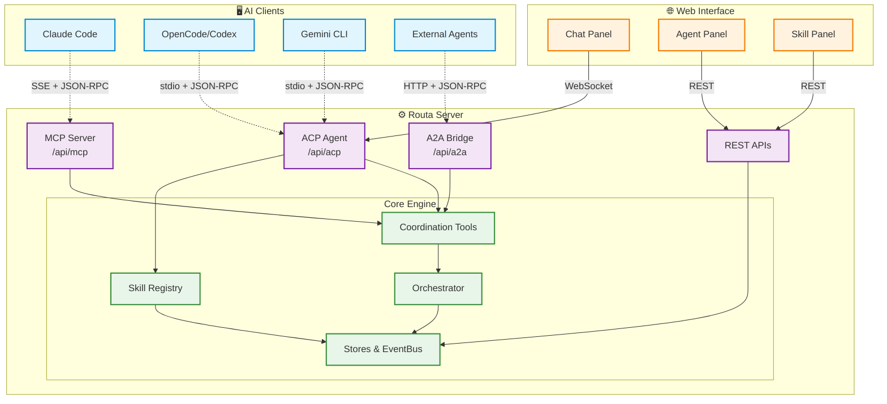
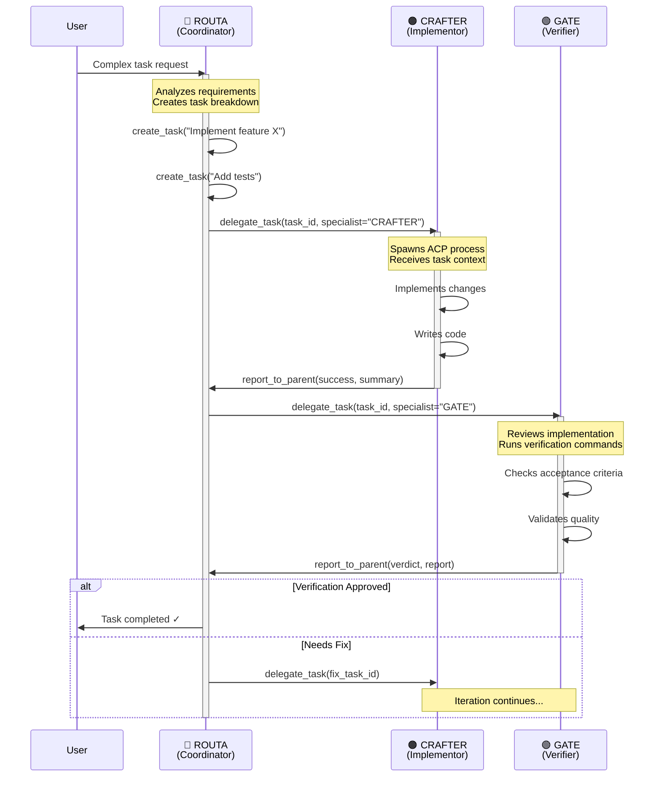

<div align="center">


# Routa

**Multi-Agent Coordination Platform for AI Development**

<p align="center">
  
</p>

[](https://www.typescriptlang.org/)
[](https://nextjs.org/)
[](LICENSE)

[Features](#features) • [Quick Start](#quick-start) • [Architecture](#architecture) • [Contributing](#contributing)

</div>

---

## Overview

**Routa** orchestrates AI agents to collaborate on complex development tasks through specialized roles and real-time coordination. Instead of a single AI handling everything, Routa enables multiple agents to work together—one plans, another implements, and a third verifies—creating a more robust and scalable development workflow.

### What It Does

- **Breaks down complex work** into manageable tasks across specialized agents
- **Coordinates execution** through task delegation, messaging, and event streaming
- **Verifies quality** with dedicated review agents before completion
- **Connects multiple AI platforms** (Claude Code, OpenCode, Codex, Gemini) through unified protocols
- **Provides real-time visibility** into agent activities, task progress, and collaboration

### Key Capabilities

| Icon | Role | Description |
|------|------|-------------|
| 🔵 | **Routa (Coordinator)** | Plans work, breaks down tasks, delegates to specialists, orchestrates workflow |
| 🟠 | **CRAFTER (Implementor)** | Executes implementation tasks, writes code, makes minimal focused changes |
| 🟢 | **GATE (Verifier)** | Reviews work, validates against acceptance criteria, approves or requests fixes |
| 🎯 | **DEVELOPER (Solo)** | Plans and implements independently without delegation (single-agent mode) |

- **🔄 Task Orchestration**: Create tasks, delegate to agents, track dependencies, parallel execution
- **💬 Inter-Agent Communication**: Message passing, conversation history, completion reports
- **📡 Multi-Protocol Support**: MCP, ACP, A2A for connecting diverse AI clients
- **🎯 Skills System**: OpenCode-compatible skill discovery and dynamic loading
- **🔌 ACP Registry**: Discover and install pre-configured agents from the community registry (supports npx, uvx, and binary distributions)
- **📊 Real-Time UI**: Live agent status, task progress, streaming chat interface

👉 For detailed protocol specs and API reference, see [AGENTS.md](AGENTS.md)

## 🚀 Quick Start

### Local Development

```bash
# Install dependencies
npm install --legacy-peer-deps

# Start development server
npm run dev
```

Visit `http://localhost:3000` to access the web interface.

## 🏗 Architecture



## 👥 Agent Roles & Workflow



| Role | Purpose | Behavior |
|------|---------|----------|
| 🔵 **ROUTA** | Coordinator | Plans work, breaks down tasks, delegates to specialists, orchestrates workflow |
| 🟠 **CRAFTER** | Implementor | Executes implementation tasks, writes code, makes minimal focused changes |
| 🟢 **GATE** | Verifier | Reviews work, validates against acceptance criteria, approves or requests fixes |
| 🎯 **DEVELOPER** | Solo Agent | Plans and implements independently without delegation (single-agent mode) |

## 📄 License

- Built with [Model Context Protocol](https://modelcontextprotocol.io/) by Anthropic
- Uses [Agent Client Protocol](https://github.com/agentclientprotocol/sdk) for agent communication
- Uses [A2A Protocol](https://a2a-js.github.io/sdk/) for agent federation
- Inspired by the [Intent](https://www.augmentcode.com/product/intent) - multi-agent coordination patterns in modern AI
  systems

This project is licensed under the MIT License - see the [LICENSE](LICENSE) file for details.

---

<div align="center">

**[⬆ back to top](#routa-js)**

Made with ❤️ by the Routa community

</div>
