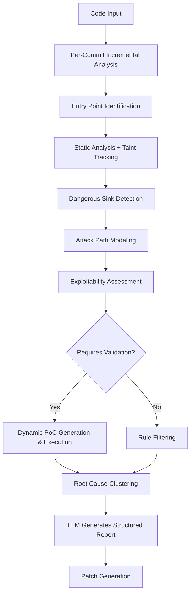

# [GitHub #132] [Feature] Design and Develop AI Security Scanning Tool - Based on Routa-JS Security Analysis

## Sync Metadata

- Source: GitHub issue sync
- GitHub Issue: #132
- URL: https://github.com/phodal/routa/issues/132
- State: closed
- Author: phodal
- Created At: 2026-03-12T13:31:12Z
- Updated At: 2026-03-12T14:01:35Z

## Labels

- `enhancement`
- `area:devops`
- `complexity:medium`

## Original GitHub Body

# AI Security Scanning Tool Design & Development

> Based on deep analysis of 20 security findings from the Routa-JS project, summarizing the design principles and development approach for AI security scanning tools.

## 📋 Background

By analyzing the results of a commercial AI security scanning tool on the `routa-js` project, we can understand its core detection principles and design a low-cost open-source alternative.

---

## 🔬 Core Working Principles

### 1. Architecture Design

```
┌─────────────────────────────────────────────────────────────┐
│                 AI Security Scanner Architecture                 │
├─────────────────────────────────────────────────────────────┤
│  ┌─────────────┐   ┌─────────────┐   ┌─────────────┐       │
│  │ AST Parsing │ → │ Data Flow    │ → │ Sink        │       │
│  │             │   │ Tracking     │   │ Detection   │       │
│  └─────────────┘   └─────────────┘   └─────────────┘       │
│         ↓                                   ↓               │
│  ┌─────────────┐                    ┌─────────────┐        │
│  │ Commit      │                    │ Attack Path │        │
│  │ Analysis    │                    │ Construction│        │
│  └─────────────┘                    └─────────────┘        │
│         ↓                                   ↓               │
│  ┌─────────────────────────────────────────────────┐       │
│  │                   LLM Reasoning Layer                  │       │
│  │  • Exploitability  • Impact Assessment  • Fix Generation │       │
│  └─────────────────────────────────────────────────┘       │
└─────────────────────────────────────────────────────────────┘
```

### 2. Main Workflow



#### Detailed Steps

| Step | Description | Tool Support |
|------|-------------|---------------|
| **1. Entry Point Scanning** | Scan API routes, task handlers, MCP/ACP tools, frontend render chains, Docker launchers | Semgrep, ast-grep |
| **2. Dangerous Sink Detection** | `child_process.exec`, command concatenation, `fetch(url)`, `dangerouslySetInnerHTML`, Docker params | CodeQL |
| **3. Data Flow Tracing** | Confirm if external input reaches dangerous sinks | CodeQL, Semgrep |
| **4. Attack Path Enhancement** | Check for missing auth, default exposure, auto-execution, persistence, public reachability | Custom rules |
| **5. Report Template Application** | Summary, Relevant lines, Validation rubric, Attack path, Proposed patch | LLM |
| **6. Dynamic Validation** | Execute PoC for verifiable issues (shell injection, SSRF, XSS, command execution) | Sandbox execution |

---

## 🛠️ Available Tools

### 1. Static Analysis Tools

| Tool | Cost | Core Capabilities | Use Cases |
|------|------|-------------------|------------|
| **[Semgrep](https://semgrep.dev/)** | 🆓 Free OSS | Custom rules, OWASP Top 10 | Command injection, XSS, SSRF, unauthenticated endpoints |
| **[CodeQL](https://codeql.github.com/)** | 🆓 Free on GitHub | Deep taint tracking, cross-function/file analysis | Complex data flow analysis |
| **[ast-grep](https://ast-grep.github.io/)** | 🆓 Free | AST-based structural search | Fast pattern matching |
| **[ESLint Security Plugins](https://github.com/eslint-community/eslint-plugin-security)** | 🆓 Free | `no-danger`, `detect-child-process` | Basic code quality |
| **ripgrep (`rg`)** | 🆓 Free | High-performance text search | Quick keyword filtering |

### 2. Dynamic Analysis Tools

| Tool | Cost | Core Capabilities | Use Cases |
|------|------|-------------------|------------|
| **[OWASP ZAP](https://www.zaproxy.org/)** | 🆓 Free | Dynamic scanning, API fuzzing | Runtime API testing |
| **[Nuclei](https://github.com/projectdiscovery/nuclei)** | 🆓 Free | Template-based vulnerability scanning | Known vulnerability verification |

### 3. Dependency Analysis Tools

| Tool | Cost | Core Capabilities |
|------|------|-------------------|
| **npm audit** | 🆓 Free | Node.js dependency CVEs |
| **[Snyk](https://snyk.io/)** | 🆓/💰 | Multi-language dependency vulnerabilities |

### 4. Docker / Container Security Scanning Tools

| Tool | Cost | Core Capabilities | Use Cases |
|------|------|-------------------|------------|
| **[Trivy](https://github.com/aquasecurity/trivy)** | 🆓 Free | Container image vulnerabilities, IaC scanning, SBOM | All-in-one container scanning |
| **[Grype](https://github.com/anchore/grype)** | 🆓 Free | Container image CVE scanning | Image vulnerability detection |
| **[Docker Scout](https://docs.docker.com/scout/)** | 🆓/💰 | Official Docker image analysis | Image supply chain security |
| **[Clair](https://github.com/quay/clair)** | 🆓 Free | Container static analysis | Image layer vulnerability scanning |
| **[Dockle](https://github.com/goodwithtech/dockle)** | 🆓 Free | Dockerfile best practices checking | CIS Benchmark compliance |
| **[Hadolint](https://github.com/hadolint/hadolint)** | 🆓 Free | Dockerfile Linter | Dockerfile syntax checking |
| **[Anchore](https://anchore.com/)** | 🆓/💰 | Deep container image analysis, policy engine | Enterprise container security |
| **[Checkov](https://github.com/bridgecrewio/checkov)** | 🆓 Free | IaC security scanning (incl. Docker Compose) | Infrastructure as Code auditing |

### 5. LLM Integration

| Purpose | Description |
|---------|-------------|
| **Report Generation** | Feed static analysis results to LLM, generate structured security reports |
| **Root Cause Clustering** | Let LLM merge multiple findings with the same root cause |
| **Patch Suggestions** | Generate fix code based on context |
| **Exploitability Assessment** | Evaluate likelihood and impact |

---

## 📊 Core Detection Rule Clusters

### Rule 1: Unauthenticated High-Privilege Endpoints

```yaml
# semgrep rule
- id: nextjs-unauthenticated-route
  patterns:
    - pattern: |
        export async function POST($REQ, ...) {
          ...
        }
    - pattern-not: |
        export async function POST($REQ, ...) {
          ...
          ensureAuthorized(...)
          ...
        }
  message: "Next.js API route missing authentication check"
  severity: WARNING
  paths:
    include: ["src/app/api/**"]
```

### Rule 2: Command Injection Detection

```yaml
- id: shell-injection-via-exec
  patterns:
    - pattern-either:
        - pattern: exec(`... ${$VAR} ...`, ...)
        - pattern: child_process.exec($CMD)
    - metavariable-regex:
        metavariable: $CMD
        regex: '.*\$\{.*\}.*|.*\+.*'
  message: "Potential command injection: avoid string interpolation in exec"
  severity: ERROR
```

### Rule 3: XSS Detection

```yaml
- id: xss-dangerous-inner-html
  pattern: dangerouslySetInnerHTML={{ __html: $VAR }}
  message: "Ensure content is sanitized with DOMPurify"
  severity: WARNING
```

### Rule 4: SSRF Detection

```yaml
- id: ssrf-unvalidated-fetch
  patterns:
    - pattern: fetch($URL, ...)
    - pattern-not: fetch("https://allowed-domain.com/...")
  message: "Validate URL source, restrict localhost, private networks, cloud metadata"
  severity: WARNING
```

### Rule 5: AI Agent Permission Bypass

```yaml
- id: dangerous-permission-bypass
  pattern-either:
    - pattern: '"bypassPermissions"'
    - pattern: '"--dangerously-skip-permissions"'
    - pattern: 'allowDangerouslySkipPermissions: true'
    - pattern: '"--allow-all-tools"'
  message: "Hardcoded permission bypass flags should be configurable and disabled by default"
  severity: ERROR
```

### Rule 6: Docker Exposure Detection

```yaml
- id: docker-port-all-interfaces
  patterns:
    - pattern: '-p $PORT:$CPORT'
    - pattern-not: '-p 127.0.0.1:$PORT:$CPORT'
  message: "Docker port should bind to 127.0.0.1 instead of 0.0.0.0"
  severity: WARNING
```

---

## 🚀 Implementation Roadmap

### Phase 1: Local Rule Filtering (Week 1-2)

- [ ] Install and configure Semgrep
- [ ] Write custom rules for the project (unauthenticated APIs, command injection, XSS)
- [ ] Integrate ast-grep for fast pattern matching
- [ ] Add ESLint security plugins

### Phase 2: CI Integration (Week 3)

```yaml
# .github/workflows/security-scan.yml
name: Security Scan
on: [pull_request]

jobs:
  semgrep:
    runs-on: ubuntu-latest
    steps:
      - uses: actions/checkout@v4
      - uses: returntocorp/semgrep-action@v1
        with:
          config: >-
            p/security-audit
            p/owasp-top-ten
            .semgrep/  # Custom rules directory

  codeql:
    runs-on: ubuntu-latest
    steps:
      - uses: actions/checkout@v4
      - uses: github/codeql-action/init@v3
        with:
          languages: javascript-typescript
          queries: security-extended
      - uses: github/codeql-action/analyze@v3

  container-scan:
    runs-on: ubuntu-latest
    steps:
      - uses: actions/checkout@v4
      - name: Run Trivy vulnerability scanner
        uses: aquasecurity/trivy-action@master
        with:
          scan-type: 'fs'
          scan-ref: '.'
          format: 'sarif'
          output: 'trivy-results.sarif'
      - name: Lint Dockerfile
        uses: hadolint/hadolint-action@v3.1.0
        with:
          dockerfile: Dockerfile
```

### Phase 3: LLM Integration (Week 4)

- [ ] Only invoke LLM for candidates filtered by rules
- [ ] Implement root cause clustering (avoid duplicate counting)
- [ ] Generate structured reports (Summary, Attack Path, Patch)
- [ ] Output by severity: Critical/High/Medium

### Phase 4: Continuous Iteration

- [ ] Iterate rules based on new findings
- [ ] Build AI Agent-specific rule sets (ACP/MCP/Provider permission bypass)
- [ ] Establish project-specific security baselines

---

## 💰 Cost Comparison

| Solution | Cost | Coverage | Setup Difficulty |
|----------|------|----------|------------------|
| AI Security Scan (per finding billing) | 💰💰💰 | 95% | ⭐ |
| Semgrep + Custom Rules | 🆓 Free | 80% | ⭐⭐⭐ |
| CodeQL (GitHub) | 🆓 Free | 85% | ⭐⭐ |
| ESLint Security Plugins | 🆓 Free | 60% | ⭐ |
| Trivy + Hadolint | 🆓 Free | 90% (containers) | ⭐⭐ |
| **Combined Solution** | 🆓 Free | **90%+** | ⭐⭐⭐ |

---

## 📋 Key Design Principles

### 1. Two-Phase Scanning Strategy

- **Phase 1**: Local rule-based fast filtering (Semgrep + ast-grep + rg)
- **Phase 2**: Only invoke LLM for candidates (reduce token costs)

### 2. Root Cause Clustering Instead of Finding Count

Multiple exploitation paths from the same root cause should be aggregated into one main issue + variants:
- Main issue: Unauthenticated background task can trigger ACP
- Variant: Auto dispatch lowers exploitation threshold

### 3. AI Agent-Specific Rules

AI scenarios not covered by traditional SAST:
- Provider permission bypass (`bypassPermissions`)
- MCP Server configuration injection
- Tool auto-execution (no confirmation dialog)
- Agent output → Persistence → Render XSS chain

---

## 📚 References

- [Semgrep Registry](https://semgrep.dev/r)
- [CodeQL Documentation](https://codeql.github.com/docs/)
- [OWASP Top 10](https://owasp.org/www-project-top-ten/)
- [GitHub Security Lab](https://securitylab.github.com/)
- [Trivy Documentation](https://aquasecurity.github.io/trivy/)
- [Docker Security Best Practices](https://docs.docker.com/develop/security-best-practices/)

---

## ✅ Acceptance Criteria

- [ ] Semgrep custom rules cover 6 core vulnerability patterns
- [ ] CI pipeline auto-scans on PR
- [ ] Container image scanning integrated (Trivy + Hadolint)
- [ ] Structured output (JSON/SARIF)
- [ ] LLM reports include Summary, Attack Path, Patch
- [ ] False positive rate within acceptable range (<20%)
