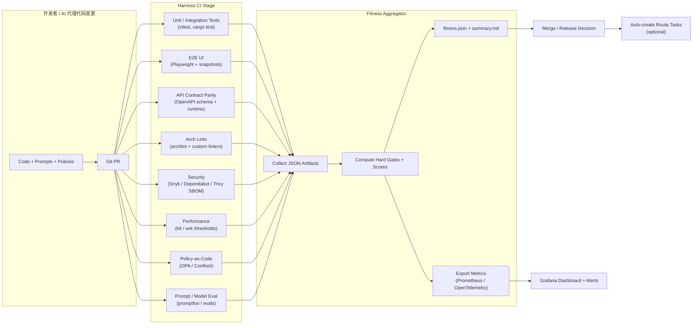
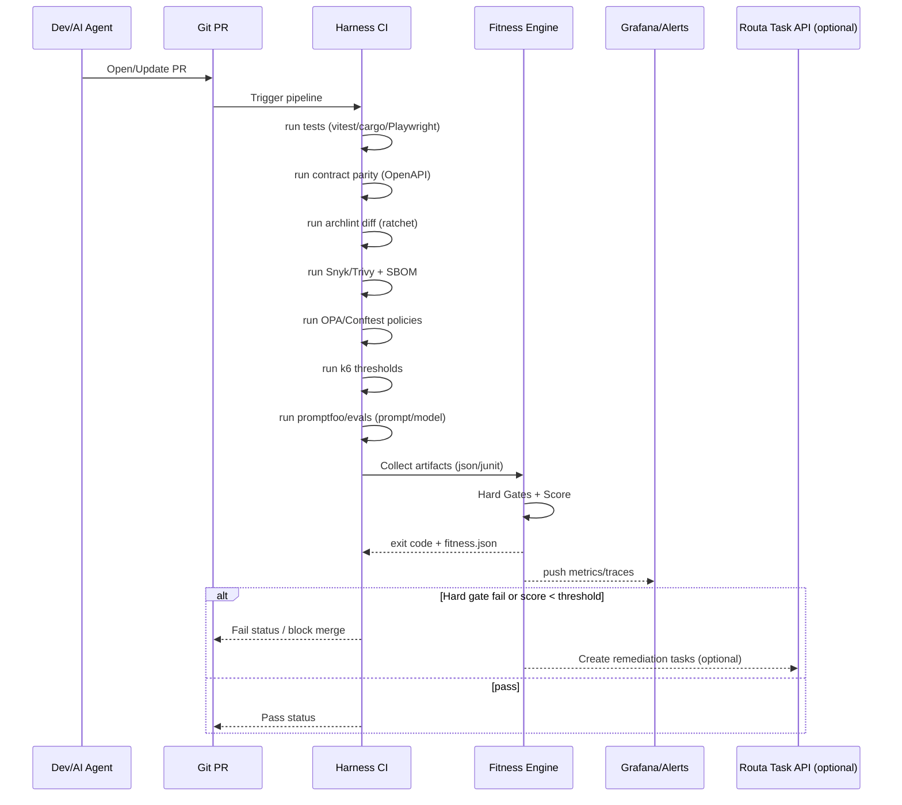

# [GitHub #139] [Defense] Implement Architecture Fitness Function for AI-driven development with CI/CD integration

## Sync Metadata

- Source: GitHub issue sync
- GitHub Issue: #139
- URL: https://github.com/phodal/routa/issues/139
- State: closed
- Author: phodal
- Created At: 2026-03-13T06:31:37Z
- Updated At: 2026-03-13T14:03:05Z

## Labels

- `enhancement`
- `area:backend`
- `area:devops`
- `complexity:large`

## Original GitHub Body

# Routa 在 AI 时代的架构设计度函数：面向 Harness Engineering 的可量化守护方案

## 执行摘要

本报告为 Routa 设计一套可量化的“架构设计度函数”（Architecture Fitness Function），用于在 AI 驱动开发（高频变更、自动生成代码、模型与提示词迭代）场景下，持续衡量并守护代码库的架构健康，并可直接落地到 的 CI/CD 与可观测性/安全测试编排实践中。该度函数采用“硬门禁 + 评分”双机制：关键风险（如测试失败、API 合约不一致、严重漏洞、策略违规）直接阻断；其他架构属性（可维护性、可演化性、性能回归等）以分维度评分并支持“棘轮（ratchet）”策略——只允许改善、不允许劣化。其理念与“以可测试的度量/测试/验证工具作为架构守护机制”的演化式架构 fitness functions 一致。

结合 Routa 现状，本方案强制利用其已具备的“契约优先”机制：`api-contract.yaml` 明确要求 Next.js 与 Rust 双后端都必须实现并保持兼容，是单一事实来源（Single Source of Truth）。

报告交付物覆盖：
- 九大维度（含 AI 特有维度）每维 ≥3 个可量化指标（计算方法/阈值建议/采集方式/频率）。
- TypeScript + Rust 两版“度函数计算器”实现草案与 CI 集成方式（含 Harness Run Step 与 Build&Push 参考）。
- 自动化守护策略（ArchLinter/OPA/Conftest/自定义 lint/测试门禁/性能回归/AI 审查器），含示例规则与配置片段。
- 测试矩阵（单元/集成/E2E/性能/AI 回归&对抗测试）与 Docker 化运行示例。
- 工具对比表（包含指定工具清单）与落地路线图、风险缓解、验收标准。

> 未指定项：部署环境、团队规模、SLA/SLO、合规框架（如 ISO/SOC2 等）均“未指定”。本报告对小型/中型/大型团队给出可选阈值与落地节奏建议，并建议根据实际 SLO 将性能/可靠性阈值参数化。

## 背景与目标边界

Routa 是一个面向 AI 开发的多代理协作平台（Multi-Agent Coordination Platform），支持在开发过程中通过多代理/路由来组织任务、验证与交付。

在 AI 驱动开发时代，架构治理的难点从“少量人手写代码”变为“高吞吐产出、低一致性风险、依赖/模型/提示词快速漂移”。因此度函数必须满足：
- **可量化**：每次 PR/合并/发布都能稳定计算数值，并可追踪趋势。
- **可守护**：既能硬阻断高风险，也能以棘轮策略逐步改善遗留问题，避免“全量整改导致停摆”。Archlint 明确主张“锁定现状、阻止变差”。
- **可集成**：对接 Harness 的 Run Step/Build&Push/安全测试编排；可产出工件（JSON/JUnit）与可观测信号（Prometheus/OpenTelemetry）。
- **AI 特有治理**：提示词/模型变更也必须像代码一样可测试、可回归、可审计；并覆盖 OWASP LLM Top 10 风险（如 Prompt Injection、敏感信息泄露、供应链风险等）。

## 度函数总体框架与计算模型

“架构设计度函数”在本方案中定义为：**任何能对架构关键特性提供客观完整性评估的机制**，并可在架构演进中阻止关键特性退化。
实现上，度函数由两部分组成：
- **硬门禁（Hard Gates）**：一旦触发直接失败（exit code ≠ 0），阻断合并/发布。
- **评分（Score 0–100）**：用于趋势、仪表盘、改进目标与分层告警（阻断/强告警/建议）。

### 计算结构

设九大维度分数为 `S_i ∈ [0,100]`，权重为 `W_i`（和为 100），总分为：

`Fitness = Σ (W_i * S_i / 100)`

建议默认权重（可按团队与风险偏好调整，尤其是 AI 维度占比）：
- 可测试性 14
- 性能 10
- 安全 14
- 可维护性 14
- 可部署性 10
- 可演化性 10
- 可观测性 10
- 合规/策略守护 10
- AI 特有维度 8

### 评分与告警级别

- **阻断**：Hard Gates 触发，或 `Fitness < 80`（默认）。
- **强告警**：`80 ≤ Fitness < 90`（默认建议）：允许合并但必须创建改进任务（可自动入 Routa 任务看板）。Routa 的任务 API 在契约中定义，可用于自动化创建/分配。
- **建议**：`Fitness ≥ 90`：仅输出改进建议/趋势提示。

### 数据流与闭环（Mermaid）



该闭环中，OPA/Conftest 可在 CI 中对“配置、测试报告、依赖清单、流水线顺序”等进行策略验证，并支持以 `--fail/--fail-defined` 控制退出码，从而天然适配硬门禁模式。
性能门禁建议使用 k6 的 Thresholds（阈值失败将返回非零 exit code），从而可作为硬门禁或评分输入。
架构回归建议采用 archlint 的 `snapshot/diff` 或对目标分支 diff 的方式，贯彻“不要让它变得更糟”的棘轮策略。

## 维度与度量指标设计

下表为九大维度的“可量化指标清单”（每维≥3项），包含计算方法、阈值建议、采集方式与频率。阈值分为“默认建议”，并在备注中给出小/中/大团队可调策略。对“可回归/可逐步改善”的指标，建议使用基线（main 分支 snapshot 或历史分布）进行棘轮控制。

> 说明：
> - 采集频率：PR（每次提交/PR）、Nightly（每日夜间）、Release（发布前）。
> - 评分方式示例：线性扣分/分段评分/基线对比扣分；硬门禁项会在下一节明确列出。

### 指标总表

| 维度 | 指标（至少3/维度） | 计算方法（示例） | 阈值建议（默认） | 采集方式（工具/输出） | 频率 |
|---|---|---|---|---|---|
| 可测试性 | TS 单测通过率 | `passed_tests / total_tests` | 必须 100%（硬门禁） | `vitest run` 退出码 + 报告；Vitest 支持覆盖率与报告输出
|  | Rust 测试通过率 | `cargo test` 是否全绿 | 必须 100%（硬门禁） | Cargo `cargo test` 运行单元/集成测试
|  | 覆盖率（TS） | statements/branches/functions/lines（加权） | 新代码 ≥80%，长期目标 ≥85（建议棘轮） | Jest 可用 `coverageThreshold` 强制失败
|  | AI 生成代码测试密度 | `AI_touched_files_with_tests / AI_touched_files` | ≥90%（大团队），≥70%（小团队） | OPA 可对变更文件与测试文件映射做策略校验
| 性能 | API p95 延迟（关键路由） | k6: `http_req_duration{p(95)}` | p95 < 300ms（按SLO参数化） | k6 Thresholds + summary JSON（可导出）
|  | 错误率 | `http_req_failed rate` | < 1%（示例） | k6 thresholds 示例包含错误率/分位阈值
|  | 吞吐与稳定性 | `RPS`、并发下抖动（stddev） | 回归≤5%（棘轮） | wrk/wrk2 为现代 HTTP 压测工具，可生成高负载
|  | 资源使用（容器） | CPU/内存峰值/冷启动 | 冷启动回归≤10% | Docker 运行期间采样；Prometheus 侧输出指标类型可建模
| 安全 | 依赖漏洞严重度门禁 | `critical/high count` | critical=0（硬门禁），high≤阈值 | Snyk CLI 支持 `--severity-threshold` 并可用于失败构建
|  | 依赖更新响应度 | `open_dependabot_alert_age` | P0：≤7天（大团队） | Dependabot security updates 可自动提 PR 修复易受攻击依赖
|  | SBOM 可用性与可扫描性 | `sbom_generated && sbom_scan_pass` | 必须生成（Release 门禁） | SPDX 定义 SBOM 概念
|  | 供应链可追溯性 | `provenance_level`（自定义映射） | 目标 SLSA L2+（建议） | SLSA 将供应链保证分级，用以增强防篡改与可追溯
| 可维护性 | 架构回归数量（TS） | `new_smells_by_severity` | medium+ 新增=0（硬门禁） | archlint 支持 diff 模式阻止新增循环依赖/层违例等，并提供解释与修复建议
|  | 模块边界违规（自定义） | 违规导入数 | 0（硬门禁或高扣分） | archlint `.archlint.yaml` 支持 layer 规则与 allowed_imports 等
|  | API 合约覆盖率 | `implemented_ops / contract_ops` | 必须 100%（硬门禁） | `api-contract.yaml` 声明双后端必须实现所有端点
|  | 文档/ADR 完整性 | `adr_count`、`stale_docs_ratio` | ADR 覆盖关键决策；陈旧率<20% | 规则化检查（自定义 linter），并将缺失计入扣分 | PR/Monthly |
| 可部署性 | 容器镜像构建可重复性 | `build_success && tag_strategy_ok` | PR 必须可构建 | Harness CI Build&Push step 等价于 `docker build`+`push`
|  | 镜像体积与层数 | `image_size_mb`、`layers` | 回归≤5%（棘轮） | Docker 多阶段与 best practices 支持精简输出
|  | Next.js 产物模式合规 | 是否启用 `output: 'standalone'`（容器化场景） | Docker 部署建议使用 standalone | Next.js 可生成 `.next/standalone` 以减少部署依赖
|  | 多环境配置健壮性 | `.env schema pass` | 必须通过 | 通过 OPA/Conftest 校验环境变量白名单/必填项（策略）
| 可演化性 | API 兼容性（破坏性变更） | OpenAPI diff：breaking changes | breaking=0（默认） | OpenAPI 合约作为事实来源
|  | 版本化策略合规 | semver/tag 规则 | 约定格式必须通过 | OPA 可用于仓库治理、commit/PR 元数据规则校验
|  | 数据迁移可逆性 | `migration_has_down` 或 `idempotent` | 关键表需可回滚/可重放 | 迁移脚本 lint + 预演（自定义；与环境未指定相关） | Release |
| 可观测性 | Trace 覆盖率（关键路径） | `traced_routes / key_routes` | ≥80%（中型），≥95%（大型） | OpenTelemetry 支持在 Node.js 采集 traces/metrics
|  | 指标暴露与类型一致性 | `/metrics` 存在；关键指标齐全 | 必须存在（生产建议） | Prometheus 指标类型与实践文档
|  | 日志结构化与关联 | `has_trace_id`/字段覆盖 | ≥90% 请求可关联 trace | OpenTelemetry 日志规范强调与资源/trace 关联
| 合规/策略守护 | Policy-as-code 通过率 | `passed_policies / total_policies` | 必须 100%（硬门禁/高扣分） | OPA 适用于 CI/CD 的 policy-as-code guardrails，且可对覆盖率/基准结果做校验
|  | 配置合规（Conftest） | deny 数量 | deny=0（硬门禁） | Conftest 基于 OPA/Rego，对结构化配置写测试并给出失败明细
|  | 合规工件完备 | SBOM/报告/审计日志齐全 | Release 必须齐全 | SPDX SBOM 可携带许可/已知安全问题/溯源等信息
| AI 特有维度 | Prompt 回归得分 | `prompt_eval_score` | 回归≤2%（棘轮） | promptfoo 支持在 CI/CD 中自动评估提示词并做安全测试
|  | 对抗/红队用例通过率 | `passed_adversarial / total` | 必须 100%（关键用例） | OWASP LLM Top 10 指出 Prompt Injection、敏感信息泄露等风险，需要测试与缓解
|  | 模型依赖锁定与白名单 | `models.lock valid` | 必须通过（硬门禁建议） | CycloneDX 规范可表示 ML 模型等组件，有助于将模型作为供应链成分治理
|  | 数据泄露风险暴露度 | `leakage_findings` | critical=0（硬门禁） | OWASP LLM Top 10 关注敏感信息泄露；需纳入策略与测试

### Hard Gates 建议清单

结合 Routa 的双后端/契约特性与 Harness 工程化门禁习惯，建议至少包含这些硬门禁（阻断）：

1) **所有测试必须通过**：`vitest run`、`cargo test`、Playwright（如启用）。
2) **API 合约一致性必须通过**：基于 `api-contract.yaml` 的 schema 校验与 parity 检查（Routa 已有工作流实践）。
3) **架构回归禁止**：archlint diff 检测到 medium+ 新增 smell 直接失败；采用基线/目标分支比较的棘轮策略。
4) **严重安全漏洞禁止**：Snyk `--severity-threshold=critical/high` 等策略；critical=0。
5) **策略违规禁止**：OPA/Conftest deny 必须为 0，且 OPA 支持通过 `--fail/--fail-defined` 控制 CI 失败。
6) **性能 SLO/回归禁止（关键接口）**：k6 thresholds 失败即阻断。
7) **AI 关键对抗用例禁止失败**：Prompt Injection/敏感信息泄露等关键测试必须全绿。

## 实现方案与工具链建议

本节以“在 Routa 现有结构之上最小侵入落地”为前提：复用其已有 Docker 多阶段构建与 Next.js standalone 输出，复用其 OpenAPI 合约与工作流验证脚本，并补齐 Harness 工程实践所需的标准化输出（JSON/JUnit/指标）。

### TypeScript ↔ Rust 互操作策略

结合 Routa 已存在“Next.js 后端 + Rust 后端”双实现、且 Next.js 支持通过环境变量将 `/api/*` 重写到 Rust 后端（`ROUTA_RUST_BACKEND_URL`）这一事实，推荐优先采用**进程/网络边界互操作**：保持 Rust 侧为独立服务（桌面端/sidecar），TypeScript/Next.js 通过 HTTP 调用（或反向代理）集成。

对照方案与权衡：

| 互操作方案 | 优点 | 缺点 | 适用场景 |
|---|---|---|---|
| HTTP/反向代理（推荐默认） | 边界清晰、可独立部署与扩容、易观测、契约可验证；Routa 已支持 `/api` 代理到 Rust。
| Node-API 原生扩展（napi-rs） | 性能高、可将 Rust 作为库嵌入 Node；Node 官方推荐 Node-API。
| WebAssembly（wasm-pack + wasm-bindgen） | 可在浏览器/Node 复用；wasm-bindgen/wasm-pack 为 Rust↔JS 高层互操作工具链。

> 若团队规模“未指定”：建议小型团队先用 HTTP/反向代理；中大型团队再评估 Node-API/wasm 以优化某些热点。

### Next.js 与 Routa 集成要点（可部署/可演化）

Routa 的 `next.config.ts` 明确包含三类构建模式：静态导出、桌面 server build、standalone build，并且当 `ROUTA_RUST_BACKEND_URL` 存在时，会在 `beforeFiles` rewrites 阶段将 `/api/:path*` 代理到 Rust 后端，从而覆盖本地 Next.js API routes。
这意味着你可以把“服务端 API 实现”作为可替换组件，并用 `api-contract.yaml` 做兼容性守护。

针对容器/服务端形态，Next.js 官方文档推荐 `output: 'standalone'`，会在 `.next/standalone` 生成可独立部署的最小产物并减少对完整 `node_modules` 的依赖。

### Docker 镜像构建与多阶段优化（Routa 现状与建议）

Routa Dockerfile 明确采用多阶段：deps（安装依赖）、builder（构建 standalone）、runner（最小运行环境），并设置默认 SQLite 运行参数与非 root 用户。

docker-compose 也已给出 SQLite 默认模式与 Postgres profile，并说明可通过 `DATABASE_URL` 切换外部 Postgres。
建议把这些“部署模式选择”纳入策略守护：
- PR 必须保证 Dockerfile 可构建（硬门禁）。
- 镜像大小/冷启动退化采用棘轮阈值；并对 `node:22-alpine` 等基础镜像策略做版本与安全更新治理（配合 Dependabot/Snyk/Trivy）。

### Harness CI/CD 集成示例（关键片段）

Harness 的 Run Step 可在 CI pipeline 中以指定镜像运行脚本，用于安装依赖、运行测试、执行迁移、计算度函数等。
Build & Push to Docker step 可从 Dockerfile 构建镜像并推送到镜像仓库，适合做“构建—扫描—推送”链路。

下面给出一个**最小但可执行的 Harness CI Stage 结构**（伪 YAML，展示关键步骤与门禁点；具体字段需按你们 Harness 项目/连接器名替换）。其中安全扫描也可采用 Harness STO 的 build-scan-push 工作流范式。

```yaml
# Harness Pipeline (pseudo)
stages:
  - stage:
      name: ci
      type: CI
      spec:
        execution:
          steps:
            - step:  # Run tests + lint + contract checks
                type: Run
                name: test_and_contract
                spec:
                  shell: Bash
                  command: |
                    npm ci
                    npm run lint
                    npm run test:run -- --coverage
                    cargo test --workspace
                    npm run api:schema:validate
                    npm run api:check
            - step:  # archlint (ratchet)
                type: Run
                name: archlint
                spec:
                  shell: Bash
                  command: |
                    npx -y @archlinter/cli diff origin/main --fail-on medium --explain
            - step:  # policy checks (OPA/Conftest)
                type: Run
                name: policy
                spec:
                  shell: Bash
                  command: |
                    conftest test policy/ ./k8s ./deploy --output json > conftest.json
                    opa eval --fail-defined --input fitness-input.json 'data.fitness.deny[_]'
            - step:  # performance smoke (k6 thresholds)
                type: Run
                name: perf_smoke
                spec:
                  shell: Bash
                  command: |
                    k6 run --summary-export=k6-summary.json perf/smoke.js
            - step:  # compute fitness score
                type: Run
                name: compute_fitness
                spec:
                  shell: Bash
                  command: |
                    node tools/fitness/fitness.ts \
                      --in ./fitness-input.json \
                      --out ./fitness.json \
                      --fail-under 80
            - step:
                type: BuildAndPushDockerRegistry
                name: build_and_push
                spec:
                  # connectorRef/repo/tags...
                  # This step maps to docker build + push. 
```

> 说明：
> - `BuildAndPushDockerRegistry` 的语义与 `docker build`/`docker push` 等价，可用于镜像产物标准化。
> - 若使用 STO：可参考官方“先代码扫描→构建→Trivy 扫镜像→无 critical 再推送”的 build-scan-push 模式。

## 自动化守护策略与测试矩阵

本节给出“持续守护”与“测试闭环”的落地策略：在 CI 中以 ArchLinter、OPA/Conftest、custom linters、测试门禁、性能回归检测、AI 生成代码审查器等实现持续守护，并提供可复制的规则/配置片段与命令。

### 守护闭环流程图（Mermaid）



### ArchLinter（archlint）守护：架构不退化（棘轮策略）

archlint 的核心价值是“diff 模式只拦截新增/恶化的架构异味”，并可对循环依赖、层违例等输出“为什么坏/如何修”。
建议做法：
- `main` 分支定期（或每次 release）生成 `.archlint-baseline.json`（snapshot）。
- PR 使用 `archlint diff <baseline>` 或 `diff origin/<target_branch>` 作为硬门禁。

**示例：生成 baseline（在 main）**
```bash
npx @archlinter/cli snapshot -o .archlint-baseline.json
```

**示例：PR 检测回归（阻断 medium 以上）**
```bash
npx @archlinter/cli diff .archlint-baseline.json --fail-on medium --explain
```

**示例：`.archlint.yaml`（按 Routa 建议的分层）**  
（建议把 `src/core/**` 视为 domain/core，`src/app/**` 视为 UI/entry；并显式允许的 import）
```yaml
rules:
  layer_violation:
    layers:
      - name: core
        path: "src/core/**"
        allowed_imports: []
      - name: app
        path: "src/app/**"
        allowed_imports: ["core"]
  god_module:
    severity: high
    fan_in: 15
    fan_out: 15
extends: nextjs
```
上述规则风格与 archlint README 中的 layer_violation 示例一致。

### OPA + Conftest：policy-as-code 守护（合规/策略）

entity 文档明确指出：OPA 适用于在 CI/CD 中实施 policy-as-code guardrails，可验证配置、校验输出、强制组织策略；同时 Conftest 更适合对 IaC/结构化配置文件进行解析与测试。
OPA 还给出直接用例：基于覆盖率报告校验阈值、根据变更选择测试、仓库治理（commit message/PR 元数据）等。

Conftest 的 README 也明确：它用于对结构化配置（Kubernetes/Terraform/Tekton 等）写 Rego 测试，并可输出失败原因。

**示例：Conftest policy（禁止容器以 root 运行）**  
（来自 Conftest README 的典型 deny 规则结构）
```rego
package main

deny contains msg if {
  input.kind == "Deployment"
  not input.spec.template.spec.securityContext.runAsNonRoot
  msg := "Containers must not run as root"
}
```
Conftest 运行方式也在其 README 中给出：`conftest test deployment.yaml` 并输出 FAIL 明细。

**示例：OPA 在 CI 中校验覆盖率/结果（stdin 输入 + fail-defined）**  
OPA CI/CD 文档给出 `opa eval --fail-defined --stdin-input` 的典型用法，用于对测试结果覆盖率进行门禁。
```bash
cat coverage-summary.json | opa eval --fail-defined --stdin-input \
  'input.total.lines.pct < 0.8'
```

> 建议的策略守护范围：
> - `api-contract.yaml` 变更时必须同时更新相应的 Rust/Next.js 路由（可通过现有 parity 脚本 + OPA 做二次门禁）。
> - Docker/部署配置：只允许白名单环境变量、禁止危险默认值（由 Conftest/OPA 管）。
> - AI 相关：模型白名单/提示词变更必须附带 eval 结果与风险扫描报告（由 OPA 校验工件齐全）。

### 安全扫描：Snyk / Dependabot / SBOM + Trivy

- Snyk CLI 文档明确：`snyk test` 可通过 `--severity-threshold=low|medium|high|critical`、`--fail-on` 等控制构建失败策略。
- GitHub Dependabot security updates 可自动创建 PR 更新易受攻击依赖到最小修复版本，并可通过 `dependabot.yml` 做分组与定制。
- SBOM：SPDX 明确定义 SBOM 及其可携带溯源/许可/安全问题等信息；CycloneDX 可表示软件/配置/甚至 ML 模型作为组件；Trivy 支持对 SBOM 输入进行漏洞与 license 扫描。
- Harness STO 官方示例也采用“先扫描代码→构建测试镜像→Trivy 扫镜像→无 critical 再推 prod 镜像”的门禁流程，可直接借鉴。

### 测试矩阵与示例（含 Docker 化测试环境）

Routa 已包含 docker-compose（SQLite 默认 + Postgres profile）可作为集成测试环境骨架。

#### 测试矩阵表

| 测试类型 | 目标 | 工具 | 示例命令（可复制） | Docker 化建议 | 门禁建议 |
|---|---|---|---|---|---|
| 单元测试（TS） | 业务逻辑、纯函数、边界条件 | Vitest/Jest | `npm run test:run -- --coverage`（Vitest）；Jest 覆盖率阈值可强制失败
| 单元/集成（Rust） | core/server/cli 行为 | cargo test | `cargo test --workspace`
| 契约测试（双后端） | Next.js vs Rust API 与 OpenAPI 契约一致 | Routa scripts + OpenAPI | `npm run api:schema:validate && npm run api:check`（按现有 workflow）
| E2E/UI | 页面交互、关键用户路径 | Playwright | `npx playwright test`
| 页面快照（UI 回归） | 防止 UI 漂移、AI 生成 UI 破坏 | Playwright + snapshot workflow | `npm run snapshots:validate -- --ci`（仓库 workflow 已使用）
| 性能（协议层） | 延迟/错误率/SLO | k6 | `k6 run --summary-export=summary.json perf/smoke.js`
| 性能（HTTP 基准） | 吞吐、固定速率延迟 | wrk/wrk2 | `wrk -t4 -c64 -d30s http://...`；wrk2 为高负载常用工具
| 安全（依赖） | CVE/License | Snyk/Dependabot | `snyk test --severity-threshold=high`
| 安全（SBOM） | 发布物透明度与审计 | Trivy SBOM scan | `trivy sbom sbom.json`（支持 SPDX/CycloneDX）
| Policy-as-code | 配置/流水线/报告合规 | OPA/Conftest | `conftest test ...`
| AI 回归（提示词/代理） | Prompt 漂移、质量退化 | promptfoo / evals | `promptfoo eval`（集成 CI/CD 指导）
| AI 对抗（Prompt Injection 等） | 防御 OWASP LLM Top 10 风险 | promptfoo red teaming + 自定义数据集 | 将 LLM01/LLM02 用例纳入测试集

### AI 生成代码治理：审查器 + 用例库

AI 时代“代码变更”不只来自人类键盘，也来自代理/工具链。建议引入三类 AI 特有守护工件：

1) **Prompt/Agent Eval 用例库（golden set + 对抗集）**
- golden set：关键能力（例如任务分解、API 调用、文件操作规划）的期望输出或判分规则。
- adversarial set：Prompt Injection、敏感信息诱导、越权工具调用等（对应 OWASP LLM Top 10）。

2) **模型依赖锁文件**（示例：`models.lock.json`）
- 白名单：允许的 provider/model、用途、数据边界、最大权限。
- 版本/配置 hash：确保模型切换可追溯与可回滚。  
  此做法与将“模型作为供应链组件”治理的方向一致。

3) **AI 变更证明（AI Change Attestation）**
- 每个涉及 prompt/model 的 PR 必须产出：`prompt-eval.json`、`risk-scan.json`、`model-lock-checked=true`。
- 用 OPA 校验工件是否齐全，并按严重度门禁。

## 示例度函数实现草案（TypeScript 与 Rust）

以下实现目标：
- 读取 CI 输出（测试/覆盖率/archlint/k6/snyk/opa/conftest/promptfoo 等）形成统一输入 JSON。
- 计算：Hard Gates + 维度分数 + 总分。
- 输出：`fitness.json`（机器可读）与 `summary.md`（人可读）。
- 在 CI 中：分数过低阻断，或只发建议性告警。Harness Run Step 运行脚本并以退出码控制 pipeline 成败。

### 输入数据契约（示例）

`fitness-input.json`（CI 组装；也可由各 step 产物汇总生成）：

```json
{
  "meta": { "commit": "abc", "branch": "feature/x" },
  "tests": { "ts": { "passed": 120, "failed": 0 }, "rust": { "passed": 80, "failed": 0 } },
  "coverage": { "lines": 0.83, "branches": 0.72, "functions": 0.81, "statements": 0.84 },
  "archlint": { "new_smells": { "medium": 0, "high": 0, "critical": 0 } },
  "api_contract": { "parity_ok": true, "missing_ops": 0 },
  "security": { "snyk": { "critical": 0, "high": 2 }, "sbom": { "present": true, "trivy_critical": 0 } },
  "performance": { "k6": { "p95_ms": 240, "error_rate": 0.002 } },
  "policy": { "opa_deny": 0, "conftest_deny": 0 },
  "ai": { "prompt_eval_score": 0.92, "adversarial_passed": 30, "adversarial_failed": 0, "model_lock_ok": true }
}
```

### TypeScript 版：`tools/fitness/fitness.ts`（关键片段）

```ts
import fs from "node:fs";

type Input = {
  tests: { ts: { failed: number }; rust: { failed: number } };
  api_contract: { parity_ok: boolean; missing_ops: number };
  archlint: { new_smells: Record<string, number> };
  security: {
    snyk: { critical: number; high: number };
    sbom: { present: boolean; trivy_critical: number };
  };
  policy: { opa_deny: number; conftest_deny: number };
  coverage?: { lines: number; branches: number; functions: number; statements: number };
  performance?: { k6?: { p95_ms: number; error_rate: number } };
  ai?: { prompt_eval_score?: number; adversarial_failed?: number; model_lock_ok?: boolean };
};

function clamp01(x: number) {
  return Math.max(0, Math.min(1, x));
}

function scoreLinear(value: number, good: number, bad: number): number {
  // value>=good => 100, value<=bad => 0 (assumes good > bad)
  if (value >= good) return 100;
  if (value <= bad) return 0;
  return ((value - bad) / (good - bad)) * 100;
}

function main() {
  const args = new Map<string, string>();
  for (let i = 2; i < process.argv.length; i += 2) args.set(process.argv[i], process.argv[i + 1]);

  const inputPath = args.get("--in") ?? "fitness-input.json";
  const outPath = args.get("--out") ?? "fitness.json";
  const failUnder = Number(args.get("--fail-under") ?? "80");

  const input: Input = JSON.parse(fs.readFileSync(inputPath, "utf-8"));

  // Hard gates
  const hardGates: string[] = [];
  if (input.tests.ts.failed > 0) hardGates.push("TS tests failed");
  if (input.tests.rust.failed > 0) hardGates.push("Rust tests failed");
  if (!input.api_contract.parity_ok || input.api_contract.missing_ops > 0) hardGates.push("API contract parity failed");
  if ((input.archlint.new_smells["medium"] ?? 0) > 0) hardGates.push("archlint regression (medium+)");
  if (input.security.snyk.critical > 0) hardGates.push("Snyk critical vulns");
  if (!input.security.sbom.present) hardGates.push("SBOM missing");
  if (input.security.sbom.trivy_critical > 0) hardGates.push("Trivy SBOM critical vulns");
  if (input.policy.opa_deny > 0 || input.policy.conftest_deny > 0) hardGates.push("Policy deny violations");
  if ((input.ai?.adversarial_failed ?? 0) > 0) hardGates.push("AI adversarial tests failed");
  if (input.ai?.model_lock_ok === false) hardGates.push("Model lock invalid");

  // Dimension scores (illustrative)
  const testability = input.coverage
    ? 0.6 * scoreLinear(input.coverage.lines, 0.85, 0.70) +
      0.4 * scoreLinear(input.coverage.branches, 0.75, 0.55)
    : 80;

  const performance = input.performance?.k6
    ? 0.7 * scoreLinear(1 / input.performance.k6.p95_ms, 1 / 250, 1 / 500) +
      0.3 * scoreLinear(1 - input.performance.k6.error_rate, 0.999, 0.98)
    : 85;

  const security = 100 - Math.min(100, input.security.snyk.high * 10);

  const maintainability = 100 - Math.min(100, (input.archlint.new_smells["low"] ?? 0) * 5);

  const deployability = input.security.sbom.present ? 90 : 50;

  const evolvability = input.api_contract.missing_ops === 0 ? 90 : 40;

  const observability = 80; // placeholder: will be computed from otel/metrics checks

  const compliance = (input.policy.opa_deny + input.policy.conftest_deny) === 0 ? 95 : 40;

  const ai = input.ai?.prompt_eval_score != null ? clamp01(input.ai.prompt_eval_score) * 100 : 80;

  const weights = {
    testability: 14,
    performance: 10,
    security: 14,
    maintainability: 14,
    deployability: 10,
    evolvability: 10,
    observability: 10,
    compliance: 10,
    ai: 8,
  } as const;

  const fitness =
    (weights.testability * testability +
      weights.performance * performance +
      weights.security * security +
      weights.maintainability * maintainability +
      weights.deployability * deployability +
      weights.evolvability * evolvability +
      weights.observability * observability +
      weights.compliance * compliance +
      weights.ai * ai) /
    100;

  const result = {
    hardGates,
    score: Math.round(fitness * 100) / 100,
    dimensions: { testability, performance, security, maintainability, deployability, evolvability, observability, compliance, ai },
  };

  fs.writeFileSync(outPath, JSON.stringify(result, null, 2));

  if (hardGates.length > 0) {
    console.error("HARD GATES FAILED:", hardGates);
    process.exit(2);
  }
  if (fitness < failUnder) {
    console.error(`Fitness score ${fitness} < ${failUnder}`);
    process.exit(1);
  }

  console.log(`Fitness score OK: ${fitness}`);
}

main();
```

**CI 使用方式（Harness Run Step）**  
Harness Run Step 本质就是在容器/环境中执行脚本并依赖退出码决定成败，因此上述脚本可直接作为 gate。

### Rust 版：`crates/routa-cli/src/fitness.rs`（关键片段）

```rust
use serde::{Deserialize, Serialize};
use std::{fs, process::exit};

#[derive(Debug, Deserialize)]
struct Input {
    tests: Tests,
    api_contract: ApiContract,
    archlint: Archlint,
    security: Security,
    policy: Policy,
    ai: Option<Ai>,
}

#[derive(Debug, Deserialize)]
struct Tests { ts: TestSuite, rust: TestSuite }
#[derive(Debug, Deserialize)]
struct TestSuite { failed: u32 }

#[derive(Debug, Deserialize)]
struct ApiContract { parity_ok: bool, missing_ops: u32 }

#[derive(Debug, Deserialize)]
struct Archlint { new_smells: std::collections::HashMap<String, u32> }

#[derive(Debug, Deserialize)]
struct Security {
    snyk: Snyk,
    sbom: Sbom,
}
#[derive(Debug, Deserialize)]
struct Snyk { critical: u32, high: u32 }
#[derive(Debug, Deserialize)]
struct Sbom { present: bool, trivy_critical: u32 }

#[derive(Debug, Deserialize)]
struct Policy { opa_deny: u32, conftest_deny: u32 }

#[derive(Debug, Deserialize)]
struct Ai { adversarial_failed: Option<u32>, model_lock_ok: Option<bool> }

#[derive(Debug, Serialize)]
struct Output {
    hard_gates: Vec<String>,
    score: f64,
}

fn main() {
    let input_path = std::env::args().nth(1).unwrap_or("fitness-input.json".into());
    let out_path = std::env::args().nth(2).unwrap_or("fitness.json".into());
    let fail_under: f64 = std::env::args().nth(3).and_then(|s| s.parse().ok()).unwrap_or(80.0);

    let raw = fs::read_to_string(&input_path).expect("read input");
    let input: Input = serde_json::from_str(&raw).expect("parse json");

    let mut hard = vec![];

    if input.tests.ts.failed > 0 { hard.push("TS tests failed".into()); }
    if input.tests.rust.failed > 0 { hard.push("Rust tests failed".into()); }
    if !input.api_contract.parity_ok || input.api_contract.missing_ops > 0 {
        hard.push("API contract parity failed".into());
    }
    if input.security.snyk.critical > 0 { hard.push("Snyk critical vulns".into()); }
    if !input.security.sbom.present { hard.push("SBOM missing".into()); }
    if input.security.sbom.trivy_critical > 0 { hard.push("Trivy SBOM critical vulns".into()); }
    if input.policy.opa_deny > 0 || input.policy.conftest_deny > 0 {
        hard.push("Policy deny violations".into());
    }
    if let Some(ai) = &input.ai {
        if ai.adversarial_failed.unwrap_or(0) > 0 { hard.push("AI adversarial tests failed".into()); }
        if ai.model_lock_ok == Some(false) { hard.push("Model lock invalid".into()); }
    }

    // Minimal scoring example (expand with full dimension model)
    let security_score = 100.0 - (input.security.snyk.high as f64 * 10.0).min(100.0);
    let maintain_score = 100.0 - (input.archlint.new_smells.get("low").copied().unwrap_or(0) as f64 * 5.0).min(100.0);
    let score = 0.6 * security_score + 0.4 * maintain_score;

    let out = Output { hard_gates: hard.clone(), score };
    fs::write(&out_path, serde_json::to_string_pretty(&out).unwrap()).expect("write output");

    if !hard.is_empty() { exit(2); }
    if score < fail_under { exit(1); }
}
```

> Rust 版适合作为 `routa-cli fitness` 子命令，以便：
> - 在桌面端/服务端统一运行；
> - 将 fitness 结果写入 Routa 自身的任务/事件系统（可选）。

## 工具与方案对比表

下表覆盖用户指定工具清单，并补充“集成复杂度（低/中/高）”与“推荐优先级（P0/P1/P2）”。其中：
- archlint：负责架构回归（棘轮）。
- OPA/Conftest：负责 policy-as-code、合规门禁、报告校验与仓库治理。
- SonarQube：适合质量门禁/质量门阈值与 CI 联动。
- Snyk/Dependabot：安全与依赖治理。
- Prometheus/Grafana：可观测性与趋势分析。
- k6/wrk：性能门禁与基准。
- Playwright/Jest/cargo test：测试体系。
- wasm-pack：Rust↔JS 互操作可选方案。

| 工具/方案 | 优点 | 缺点 | 适用场景 | 集成复杂度 | 推荐优先级 |
|---|---|---|---|---|---|
| ArchLinter（archlint） | “只拦新增/恶化”棘轮策略；可检测循环依赖/层违例等并给出解释与修复建议；支持 snapshot/diff。
| OpenPolicyAgent（OPA） | 通用 policy engine；适用于 CI/CD guardrails；支持 stdin 输入、`--fail-defined` 等便于门禁；可做覆盖率/基准/仓库治理。
| Conftest | 对结构化配置写测试（K8s/Terraform 等），失败原因清晰；基于 Rego。
| SonarQube | 质量门（Quality Gate）可回传 CI 并用于失败构建；适合 PR decoration 与持续质量治理。
| Snyk | CLI 可按严重度阈值失败构建；覆盖依赖漏洞与多种扫描。
| Dependabot | 可自动提 PR 修复安全漏洞（actions/deps），支持分组。
| Prometheus | 指标类型与实践成熟；适合拉取式监控。
| Grafana | 开箱支持 Prometheus 数据源与仪表盘；适用于可视化与告警。
| k6 | Thresholds 可作为性能门禁；支持 summary 导出与自定义报告。
| wrk | 现代 HTTP 压测工具，单机可打高负载。
| Playwright | `npx playwright test` 可跑端到端；官方提供 CI 指南与报告能力。
| Jest | 覆盖率阈值 `coverageThreshold` 可强制测试失败。
| cargo test | Rust 官方测试入口，覆盖 src 单元与 tests/ 集成。
| wasm-pack | Rust→Wasm 工具链，支持不同 target（web/nodejs），并助于打包到 npm。

## 迁移与落地步骤、时间估算、风险缓解与验收标准

### 落地步骤与时间估算（建议按迭代推进）

> 团队规模“未指定”：下表给出适用于中等复杂度团队的默认工期。小团队可压缩（减少 P1/P2），大团队需增加策略/可观测性与治理流程工时。

| 阶段 | 工作内容 | 产出物 | 预计时间 |
|---|---|---|---|
| 基线建立 | 统一 CI 产物格式（JSON/JUnit）；补齐 `fitness-input.json` 汇总器；确定权重与初始阈值 | `fitness-input.json` 规范、初版 `fitness.ts`、基线报表 | 3–5 天 |
| 硬门禁对齐 | 把“测试、API 合约、archlint、新增 critical 漏洞、policy deny、k6 thresholds”接入 Harness 并阻断 | Harness pipeline gate、失败原因映射表 | 5–8 天 |
| 评分体系上线 | 九维评分落地 + Grafana 看板 + 告警分级（阻断/强告警/建议） | `fitness.json`、dashboard、告警规则 | 1–2 周 |
| AI 特有治理上线 | promptfoo/evals 集成、对抗用例库、models.lock、OPA 校验工件齐全 | `prompts/`、`ai/evals/`、`models.lock`、策略 | 1–2 周 |
| 供应链与合规增强（可选） | SBOM 生成/扫描、SLSA provenance、发布门禁 | SBOM、provenance、Release gate | 1–2 周 |
| 持续优化 | 棘轮阈值调优、执行时间优化、自动修复建议与任务自动创建 | 变更准入说明、自动化修复 playbook | 持续 |

### 关键风险与缓解措施

| 风险 | 表现 | 缓解措施 |
|---|---|---|
| 门禁过严导致吞吐下降 | PR 大量失败、开发停滞 | 采用 archlint 棘轮策略（只拦新增），覆盖率采用“新代码阈值 + 棘轮提升”，把部分指标从阻断改为强告警。
| 工具输出不稳定/难解析 | wrk 输出文本；多工具格式不统一 | 首选可导出 JSON 的工具（k6 summary、Snyk JSON、Conftest JSON）；统一汇总到 `fitness-input.json` |
| 性能测试波动大 | PR 性能门禁频繁误报 | PR 只跑 smoke+阈值宽松；Nightly 跑大负载并用统计基线；对关键指标做“回归百分比”而非绝对值 |
| AI 评估成本/泄露风险 | prompt 测试调用外部模型、成本上升；敏感数据外泄 | 测试集脱敏；最小化输入；对 AI 流程做策略门禁与审计；遵循 AI RMF 的治理/测量/管理原则。
| 双后端契约漂移 | Next.js 与 Rust 实现不一致 | 强制 `api-contract.yaml` 为单一事实来源，PR 必跑 parity；合约变更必须更新双方实现。

### 验收标准（Definition of Done）

| 类别 | 验收标准 |
|---|---|
| 度函数可用性 | 在 PR 与 main 合并流水线中均能生成 `fitness.json`；Hard Gates 失败时可明确定位到维度/指标/工具输出 |
| 守护有效性 | archlint 回归（medium+ 新增）、API 合约不一致、critical 漏洞、policy deny、k6 阈值失败均会阻断合并/发布
| 工程集成 | Harness Run Step 可运行测试/策略/度函数脚本并用退出码控制 pipeline；Build&Push 可构建推送镜像并可插入扫描链路
| 可观测性 | 至少：CI 产物可留存（artifact），并有 Grafana 看板展示 fitness 趋势（或等价可视化）；关键运行时服务具备 traces/metrics 基础输出
| AI 特有治理 | prompt/model 变更必须带 eval 报告；对抗用例（Prompt Injection/敏感信息）必须全绿；模型锁文件校验通过

---

**附：与 Routa 现状的直接对齐点（便于工程团队快速接入）**
- `api-contract.yaml` 已定义“双后端必须实现”的合约约束，可直接作为可演化性/可维护性门禁核心。
- 仓库工作流已实现 API schema validation 与 parity 报告上传（artifact），可作为度函数输入源。
- 页面快照验证工作流已使用 Playwright 与 `xvfb-run` 方式在 CI 运行，并上传报告，可纳入可测试性/可维护性。
- Dockerfile 已采用 Next.js standalone + 多阶段构建；官方文档也支持该部署瘦身路径，可作为可部署性指标的基线。
