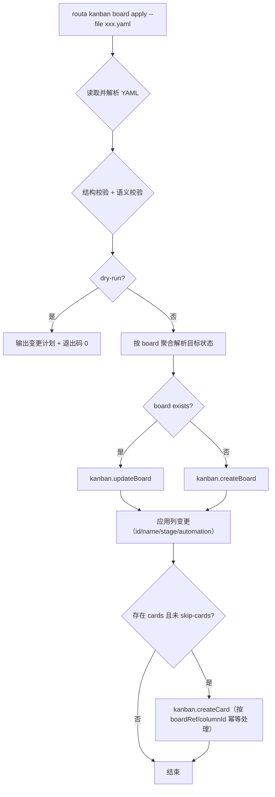
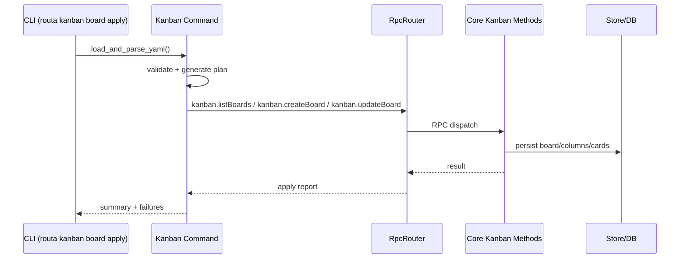

# [Feature] 支持从 YAML 配置初始化/加载 Kanban（便于 CLI 一键恢复和批量同步）

## 背景

目前项目已有：

- `workflow` 子命令支持 YAML 加载与执行（`routa workflow run`）。
- Kanban 能力已完整暴露在 CLI 与 RPC：
  - `crates/routa-cli/src/main.rs`（`KanbanAction::Board/Card/Column` + subcommands）
  - `crates/routa-cli/src/commands/kanban.rs`（通过 `RpcRouter` 调用 `kanban.*` 方法）
  - `crates/routa-core/src/rpc/methods/kanban.rs`（`create_board` / `update_board` / `create_card` 等）
  - `src/app/api/kanban/boards`（REST 入口与前端共享存储模型）

但尚无“声明式 Kanban 配置”能力。希望支持一个可落地到仓库的 YAML，CLI 读取后完成 Board/列/自动化字段的同步，便于：

- 一次恢复：CI/本地环境重建后快速恢复看板布局；
- 可复制：团队共享同一套列和自动化策略；
- 可审计：配置文件作为唯一来源，便于 PR 评审。

## 目标

1. 支持从 YAML 文件加载 Kanban 配置；
2. CLI 提供 dry-run 与 apply 两种模式，具备可读的变更计划输出；
3. 对现有 codebase 做最小侵入改造：优先复用现有 `kanban` RPC 与 schema；
4. 后续可复用于工作区初始化脚本或导出/导入流程。

## 建议配置 Schema（v1）

```yaml
version: 1
name: "project-kanban"
workspaceId: "default"
mode: merge # merge | replace | upsert

boards:
  - id: "core"
    name: "Core Board"
    isDefault: true
    columns:
      - id: "backlog"
        name: "Backlog"
        color: "slate"
        stage: "backlog"
        automation:
          enabled: false
      - id: "dev"
        name: "Dev"
        color: "amber"
        stage: "dev"
        automation:
          enabled: true
          providerId: "routa-native"
          role: "CRAFTER"
          transitionType: "entry"
          requiredArtifacts: ["test_results", "code_diff"]
          autoAdvanceOnSuccess: false
    cards:
      - boardRef: "core"
        title: "Implement issue sync tool"
        description: "Sync issue tracker state to task cards."
        priority: "high"
        columnId: "todo"
        labels: ["feature"]
```

说明：

- `boards[].id` 可选；不带 ID 时通过 `workspaceId + board name` 做 upsert 键，便于跨机器一致；
- `cards[].boardRef` 支持 `id` 或 `name`；
- `mode` 语义：
  - `upsert`（默认）：无则建，有则更新；
  - `merge`：更新时以配置为主覆写列与关键字段；
  - `replace`：先清空工作区可见的 board 再创建（危险，需 `--force`）。

## CLI 设计

新增子命令（计划放在 `routa kanban board` 下）：

- `routa kanban board apply --file <kanban.yaml> --workspace-id default --mode upsert`
- `routa kanban board validate --file <kanban.yaml>`
- `routa kanban board apply --file <kanban.yaml> --dry-run`
- `routa kanban board apply --file <kanban.yaml> --workspace-id default --skip-cards`

执行策略：

- Parse YAML；
- 结构校验 + 语义校验（列 ID 去重、列引用合法、board 重名策略）；
- 生成变更计划（dry-run 显示）；
- 非 dry-run 时逐项调用现有 RPC：
  - board 不存在：`kanban.createBoard` + `kanban.updateBoard`；
  - board 存在：`kanban.updateBoard`；
  - columns/cards 使用 `kanban.updateBoard` / `kanban.createCard`。

## 处理流程（Mermaid）



## 同步链路（执行细节）



## 与现有 codebase 的对齐点

- 最大化复用现有 `kanban.createBoard` 与 `kanban.updateBoard`，避免单独新增底层写入逻辑；
- CLI 侧新增 `serde_json` 组装逻辑即可，不破坏现有 `commands::kanban` 模块结构；
- 列自动化字段直接复用 `KanbanColumnAutomation`（包括 `transitionType/requiredArtifacts`）；
- 可选地将 schema/验证放在独立模块（`routa-core`）共享，支持未来从 API/GUI 复用。

## 与现有 codebase 的 Review（重点问题）

### 已确认（高）

- 列自动化支持多 step 的顺序执行，不是并发执行。
- 在 `workflow-orchestrator` 里，Automation 按 `steps` 串行推进；一个 step 完成后才会开始下一步。
- 证据：`src/core/kanban/workflow-orchestrator.ts`。

### 关键 gap（建议修正）

1. `create_board` 与 `update_board` 的 schema 能力不对称。
   - `create_board` 仅接受 `columns: Vec<String>`（列名），不会接收对象化列（含 `stage/automation`）；
   - `update_board` 才支持 `Vec<KanbanColumn>`，所以首次 upsert 若直接用 create+update 路径，会额外需要补齐全量列。

2. `update_board` 是全量替换列（非 merge）。
   - `normalize_columns` 直接覆盖 board 的 `columns` 字段；未列出的列会被删除。
   - 这会影响 `merge` 和 `replace` 的语义，缺少“仅更新命名列、不影响未声明列”的行为。

3. `normalize_columns` 重写 `position = index`。
   - YAML 里的 `position`（若后续补充）会被覆盖为顺序下标；可复用性差。

4. 自动化字段验证不足。
   - `stage`、`transitionType`、`requiredArtifacts` 在 Rust/TS 侧类型边界不一致且验证分散；非法值可能下沉到运行时才暴露。

5. 卡片幂等规则需要更强主键。
   - 当前计划中的 `title + boardRef + columnId` 在重复标题时无法稳定去重；建议引入显式 `externalId` 或 card id 映射。

6. `replace` 模式缺少原子删除与回滚。
   - 当前 RPC 没有“按工作区清空 board”原子能力，CLI 层替代实现会带来部分失败时的一致性问题。

### 建议执行前补测

- board id/name 映射是否唯一；同名 board 应 fail-fast；
- `columns[].id` 去重、`boardRef` 可解析、`columnId` 引用有效性；
- `requiredArtifacts` 白名单校验；
- `replace` 与 `skip-cards`、`continue-on-error`/`stop-on-error` 的交叉行为。

## 分阶段实现

1. 先在 CLI 层支持 `validate`/`apply --dry-run`（最小实现，仅校验与计划输出）；
2. 再接入 board/column 的 upsert 路径（不含 card）；
3. 补齐 cards 导入和幂等策略（基于 title + boardRef + columnId 的匹配）；
4. 添加单测（parser/schema 校验 + CLI 命令回归）；
5. 文档：新增 `.routa/kanban.config.yaml` 示例和常见场景说明。

## 关键实现点（建议）

- 幂等与重复判断
  - board：优先 `id`，退化到 `workspaceId + board name`；
  - card：`title + boardRef + columnId` 作为默认幂等键（可配置后续切换为 `externalId`）；
- 错误分级
  - 配置级错误（schema/重复列 id）直接 fail-fast；
  - 运行时单 board 失败继续下一 board（默认 `continue-on-error`，可选 `--stop-on-error`）。
- 事务策略
  - 单 board 级别输出结果明细，避免一次失败回滚整个文件；
  - 之后可扩展 server side 的批量导入 RPC 实现真正原子提交。

## 验收标准

- 命令执行成功后，给定 YAML 能稳定复现同构 board；
- `--dry-run` 不做任何写入，能输出清晰变更计划；
- 列 stage/automation 字段可以从 YAML 成功同步；
- 与现有 API/CLI 的功能互不冲突（现有 `routa kanban board/card/column` 命令继续可用）；
- 新增测试覆盖 schema 解析、重复列校验、board upsert、dry-run 输出。

## 风险与边界

- `createBoard` 当前仅支持 `columns: Vec<String>`，如要一次性传对象列信息，可能需要配合 `updateBoard` 补齐；
- 同名 board 的歧义必须定义清晰（建议按 `id`/`name` 优先级策略）；
- replace 模式具备破坏性，默认关闭并强制 `--force`。

## 相关文件

- `crates/routa-cli/src/main.rs`
- `crates/routa-cli/src/commands/kanban.rs`
- `crates/routa-core/src/rpc/methods/kanban.rs`
- `crates/routa-core/src/models/kanban.rs`
- `src/core/models/kanban.ts`
- `src/app/api/kanban/boards/route.ts`
- `docs/issues/_template.md`

## 建议关联项

- `docs/issues/2026-03-11-card-detail-rerun-mechanism-issues.md`
- `docs/issues/2026-03-12-gh-132-feature-design-and-develop-ai-security-scanning-tool-based-on-routa-js-s.md`
